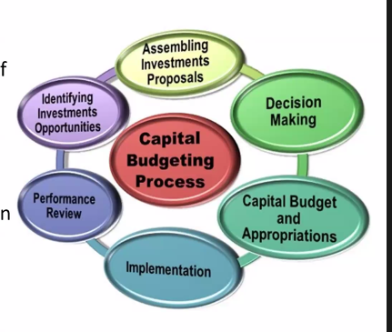
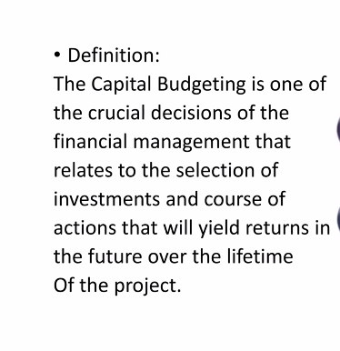

# Investment Decisions

## Feasibility Study

- Collecting statistical data & taking the decision based on that data.
  - Talk with employee, customers, suppliers, etc.
  - For example, for buying a modern dying machine (due to pressure from upper management) we need to talk with wholesalers to consult about the usability of the product.

## Economic Feasibility

- Cost benefits of the project.
  - Investment cost & return on investment.
- Time is also considered, which is required for the profit to be made.

## Market Feasibility

- For example, for waterless dyeing machine, considering if the chemical & other materials are available in the market.
- Analysis to view the potential impacts of market demand, competitiveness, activities etc.
- Chemical fair, textile fair etc. helps us to know about new technologies which is part of market feasibility.
- Check if the product is suitable for the market or not due to competition, demand, etc.

## Financial Feasibility

- The money required as capital for the project.
- Do we have enough money to invest in the project?
  - How we are bringing the fund?

## Technical Feasibility

- Our most competition is we are not technically sound.
  - Floor in charge do not know all the functionality of the machine. They are not interested to learn further information of the machine.
  - Thus, the upgrade technology is not used properly.
- For example, for waterless dyeing, giving training to the workers to use the machine, the roadmap to set up the machine, etc.
- Is the technical investment worth the money?

## Capital budgeting process

- 4 processes of capital budgeting.
