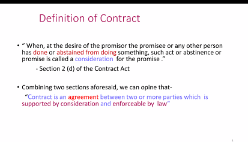
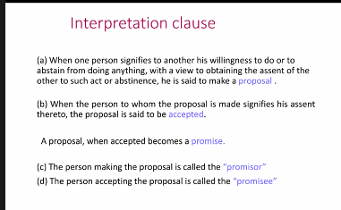
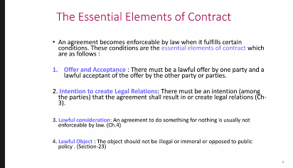
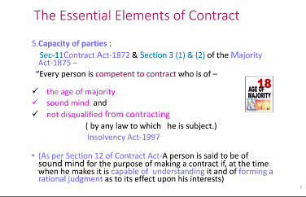
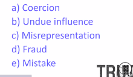
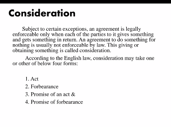
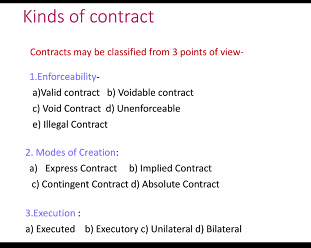

## Definition of contract

## Interpretation clause

**Q:** Probable short questions:

- Promise
- Promisor
- Promisee

## Essential Elements of Contract

6. Free consent

7. Writing and registration

8. Certainty

9. Possibility of performance: Can not be impossible. It has to be impossible for both parties.

**Q:** Broad type question.

## Kinds of Contract

### 01. Enforceability:

Two types: Valid and Voidable.

### 03. Execution:

Four types: Executed, Executory, Unilateral, Bilateral.
