# Marketing Basics

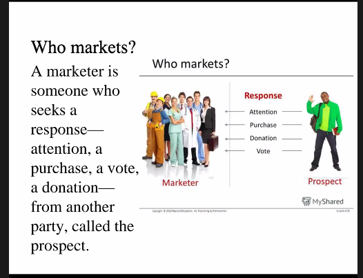

- Everyone is marketer.

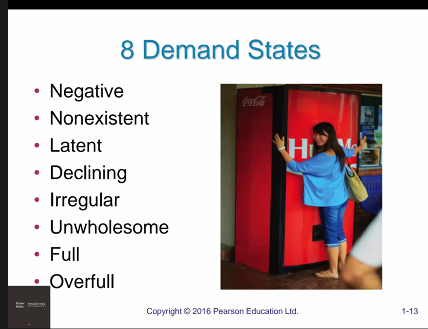

## Demand

- Need: something that is essential for survival.
- Demand: something that is not essential for survival. Various upon stage of oneself.

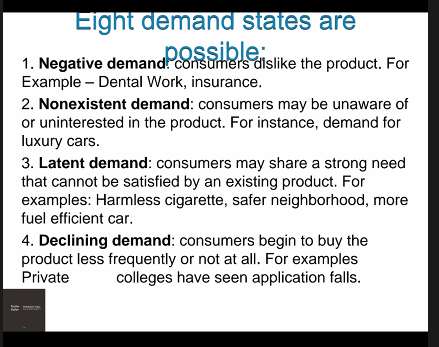

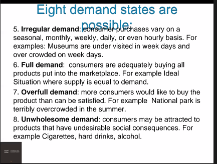

## Core Concepts

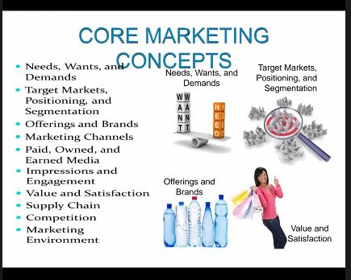

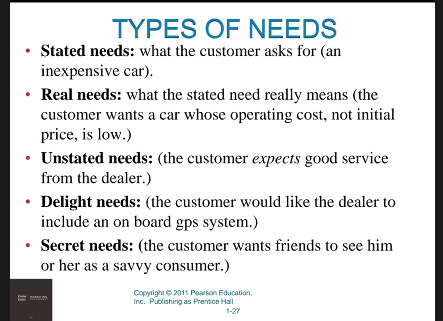

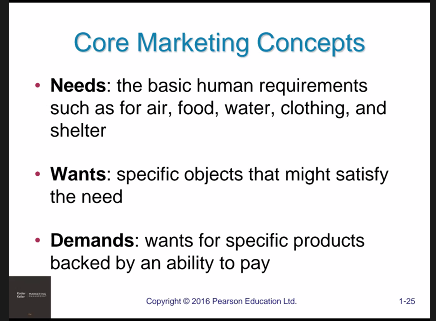

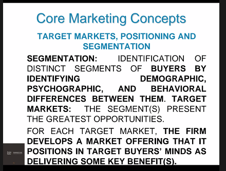

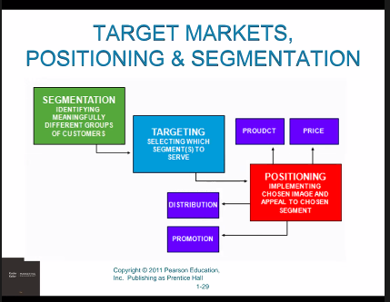

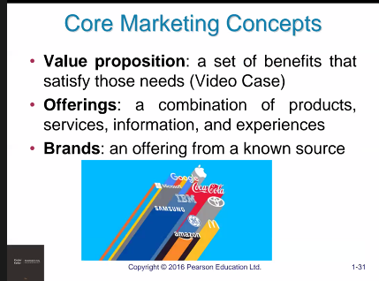

## Simple Marketing system

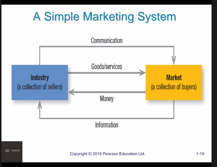

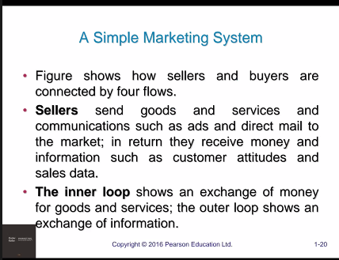

## Modern Exchange Economy

- This complex system easily fills the consumer's demand. As here, feedback system is more dominant.

## Key customer markets

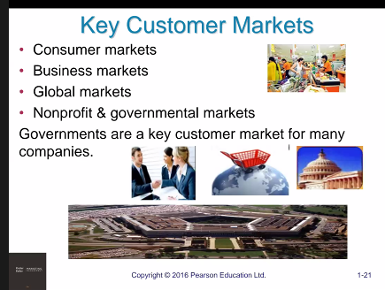

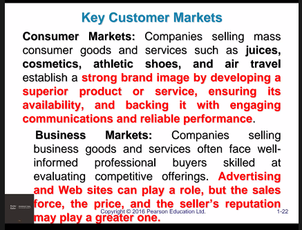

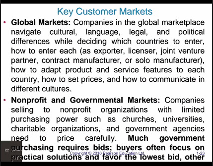

## Marketing channels

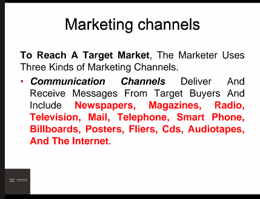

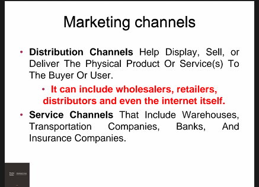

## Core marketing concepts

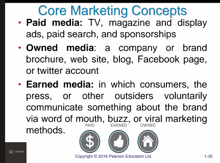

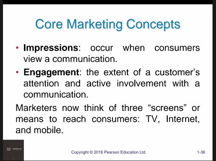

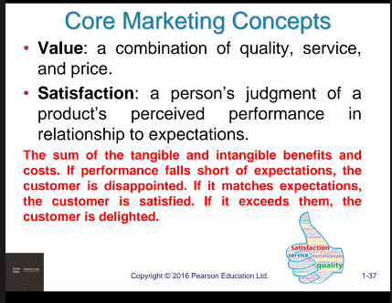

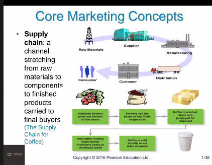

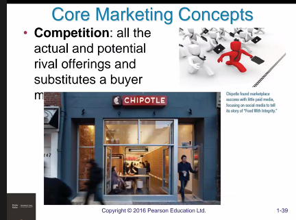

## Environment

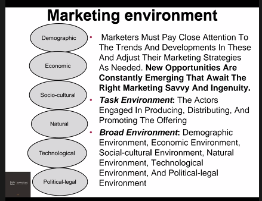

## New marketing realities

- Next Class

## P's

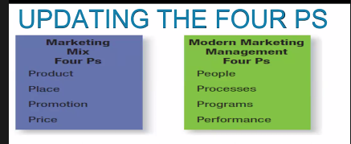
