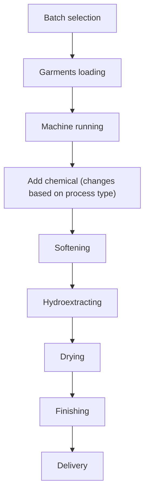
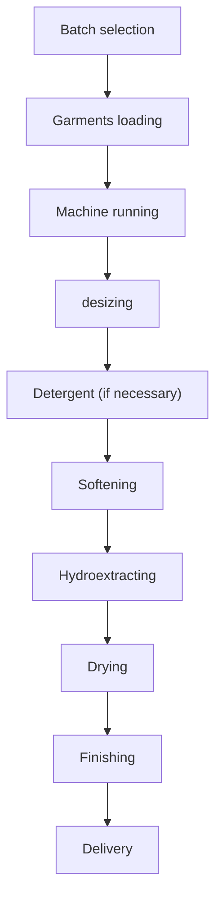

# Garments Washing

## Chapter Outline

- Definition
- Requirements of garments washing
- Types of garments washing
- Process (objectives, chemical name, chemical functions, flow process, standard recipe) of each washing type
- Washes
  1. Normal Wash
  2. Enzyme Wash
  3. Stone Wash
  4. Bleach Wash
  5. Sulphide Wash
  6. Acid Wash
  7. Pigment Wash
  8. Caustic Wash
  9. Silicon Wash

## Washing Definition

Garments washing is a technology which cleans and changes outlook or appearance of garments.

Two types: dry process, where no chemical or washing machines are used, and wet process, where chemical and washing machines are used.

## Objectives or requirements of Garments Washing

- To remove dirt, dust and waste materials from garments.
- To remove size materials from garments.
- Give soft hand feel.
- To improve outlook or appearance of garments.
- To improve color fastness and abrasion resistance property.

## Wet Process flow chart

### Standard flow process of apparel washing

### Normal Wash

_Standard recipe_

## Dry Process

1. Whiskering
2. Hand brush
3. P.P. spray
4. P.P. Sponge
5. Tackling or Tagging
6. Tyeing in
7. Grinding
8. Destroy
