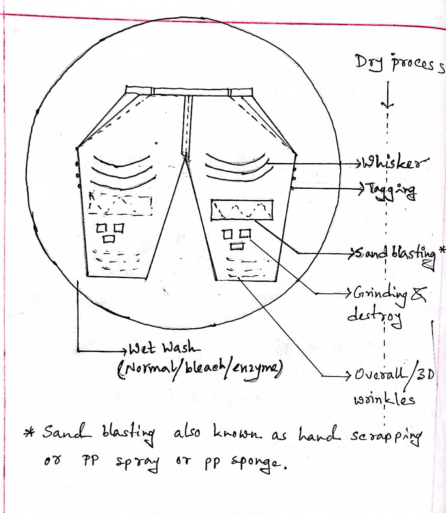

# Apparel Washing (Dry Process)

_Fig:_ List of Dry process

## Washing

The purpose of domestic washing to clean the garments and make it more comfortable to wear. But the purpose of industrial washing is to make the garments more fashionable. Industrial washing changes appearance, properties, removes size materials. It also shrinks the garments so that shrinkage does not occur after the garments are washed by the customer.

## Why wet wash is needed after dry wash? (Important for CT)

Dry wash is wash where effect is applied on a particular area. Fading, cutting etc. are the examples of those effects. But all the washing purposes like cleaning, changing appearance, properties, shrinkage is not archived by dry wash. So no matter how many times dry wash is done, wet wash is needed to archive those purposes.

## Write down the process of whisker.

_Fig:_ Whisker

**Instruments:**

1. Rubber board
2. Sand paper
3. Knife
4. Chalk
5. Item on which effect is applied.

**Working Process:**

1. Mark the area on rubber board where effect is applied by chalk.
2. Cut the area by knife.
3. Smooth the area by sand paper.
4. Put the item on the rubber board.
5. Rub the area of denim by sand paper.

After wet wash, we get the desired effect.

## Write down the process of sand blasting.

**Process of sand blasting:**

Fine particles of $Al_2O3$ is used as a sand. It is sprayed at a high speed on the denim by air pressure. The area where the sand is sprayed, the color is faded due to frictional effect.

One kind of gun for blasting sand is used with input and output and a housing for sand. There is a stop and start button. The sand is put in the housing. The air pressure is applied to the gun. The gun is moved on the denim. In the area where the sand is sprayed, the color is faded due to frictional effect.

The angle between denim and the gun can vary between $10^{\circ}$ to $20^{\circ}$.

After wet wash, we get the desired effect.

**Precautions or safety measurements:**

The high speed sand can harm the worker if it hits the worker. Inhaling sands or friction between sand and skin can be injurious. So the worker should wear safety glass, mask, gloves, apron etc.

The client not only monitors the quality of the product but also the safety measurements of the workers. So the factory must maintain the safety measurements.

Taking all the safety measurements are troublesome. So this sand blasting is replaced by laser fading.
