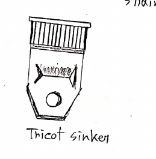

# Study on primary knitting elements of warp and weft machines

## Introduction

A knitting machine is a machine which is used to produce knitted fabrics by interlooping one or more yarns. Every knitting machine has some basic elements which are used to form loops. These elements are different for weft and warp knitting machine.

## Objectives

- To study the basic elements of weft and warp knitting machine.
- To study the functions of the basic elements of weft and warp knitting machine.
- To be able to draw figures of the basic elements of weft and warp knitting machine.

### Basic knitting elements of weft knitting machine

**1. Needle**

The fundamental elements in construction of knitted fabrics is the knitting needle. There are three types of needles:

1.  Latch needle
2.  Spring beard needle
3.  Compound needle

**Functions of needle:**

Needle is rised to clear the old loop from hook and to receive the new loop above it on needle stem.

**Figure of needle:**

_Figure: Latch needle_

**2. Cam**

Cams are the devices that convert the rotary into suitable reciprocating action for the needles or other elements. There are three types of knitting cams:

1.  Knit cam
2.  Tuck cam
3.  Miss cam

**Functions of cam:**

1. Produce the motion of needles.
2. Drive the needle.
3. Formation of loops.

**Figures of cam:**

_Figure: Knit cams_

**3. Sinker**

Sinker is a thin metal plate with an individual or collective action approximately at right angles from the hook side between adjoining needles.

**Functions of sinker:**

1. Loop formation.
2. Holding down.
3. Knocking over.

**Figure of sinker:**

_Figure: Sinker_

### Basic knitting elements of warp knitting machine

**1. Compound needle:**

Has needle and sliding latch.

_Figure: Compound needle_

**2. Guide bar:**

Presents the yarn into the needle.

_Figure: Guide_

**3. Sinker bar:**

Performs holding down function.

_Figure: sinker bar_

**4. Chain link:**

They are the links that connect the needles together. 4 types of links are used:

1. Link-a (plain)
2. Link-b (tail grinding)
3. Link-c (plate grinding)
4. Link-d (slope both side)

_Figure: Chain link_

## Conclusion

This experiment gives up a basic idea about the knitting elements of weft and warp knitting machine. It also gives us a basic idea about the functions of the elements. This experiment will help us to understand the knitting process and the mechanism of the knitting machine.

## Notes

- **Wales:** A wale is a predominantly vertical column of needle loops produced by the same needle knitting at successive knitting cycles, and thus intermeshing each new loop through the previous loop.
- **Course:** A course is a predominantly horizontal row of loops produced by adjacent needles during the same knitting cycle. It is the yarn supplied by the feeder.
- We know gauge is _needles per inch_, and say circumference of cylinder is $\pi D$. So, the number of needles in a cylinder is $\pi D \times gauge$. No of needles is also known as wales.
- In **weft knitting** course is along horizontal and in **warp knitting** course is along vertical.
