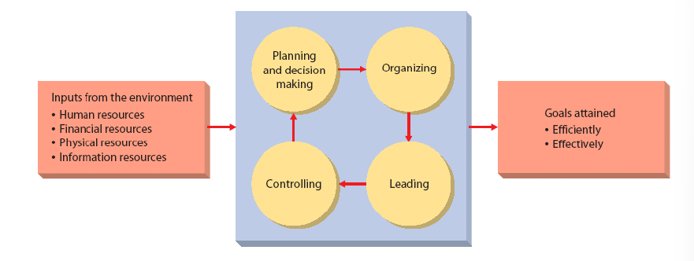
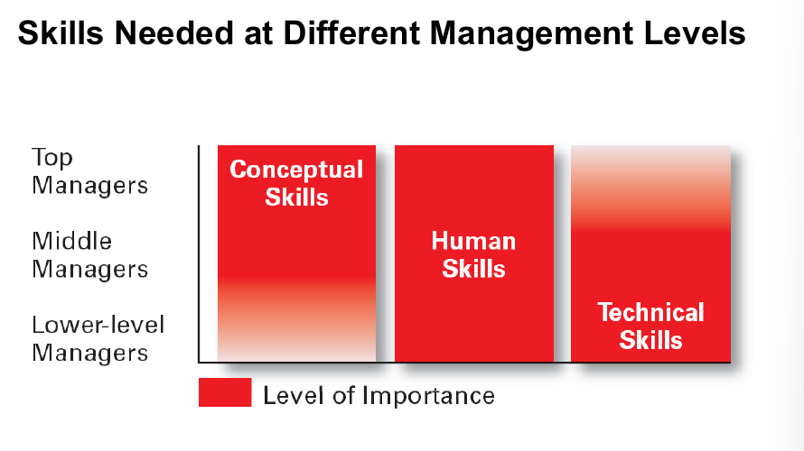
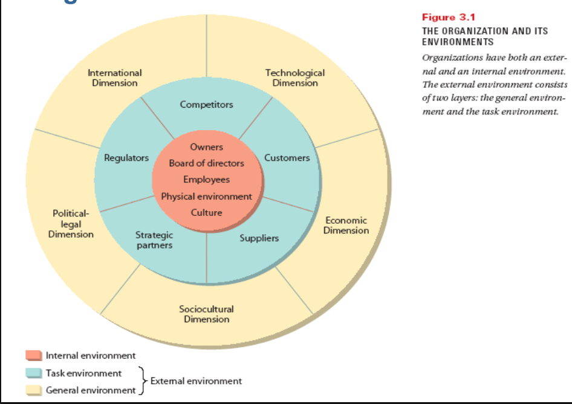
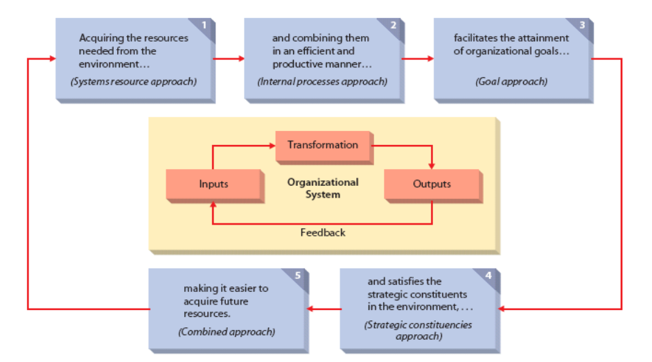

# Management & Organization

## Introduction to Industrial Management

### Management

Management is consists of,

1. Planning
2. Organizing
3. Leading
4. Controlling

> The more you manage yourself, the more control you have on others.

> A set of activities (planning, organizing, leading, and controlling) directed at an organization’s resources (human, financial, physical, and information) to achieve organizational goals in an efficient and effective manner.

### Industry & Industrial Management

**Organization:** Group of people + Specific Purpose + Infrastructure (Deliberate structure + Organogram).

Organization involves input, processing & output and transforms a specific material into a finished product.

**Industry** is a place where product or services are produced for profit.

**Textile industry** is a place where a textile product or service is produced for profit.

University is an industry as it provides educational service to the students and profit is made through the success of students.

**Industrial Management** is the managerial process conducted in the industry.

## Types of Industrial Management

1. **Production Management:** Managing the production process of products.
2. **Employee Management**
3. **Compliance Management:** Maintaining compliance. For example, resolving conflicts, handle situations of equipment failures.

## Organizational Resources

Organizational resources are the physical, financial, informational, and human capacities of an organization. There are four types of organizational resources:

**1. Human Resources**

Human resources are the people who work for an organization in jobs that produce the products or services of the business or organization. It refers to managerial talent and labor.

Employees are considered in the most underrated Assets of any organization. They are important for the functioning of any organization, without which the activities of an organization will come to a standstill.

HR department is responsible for hiring of human resources via screening process.

**2. Financial Resources**

Financial resources are the funds used to acquire the human and material resources needed to produce products and services. It refers to capital investments to support ongoing and long-term operations.

Financial resources are important for the functioning of any organization. Financial resources are needed to pay salaries, purchase raw materials, and to meet other day-to-day expenses.

**3. Physical Assets**

Physical assets are the tangible and intangible assets an organization uses to produce goods or services. It refers to raw materials, office, production facilities, and equipment.

Physical resources are important for the functioning of the organization, since without things like equipment and inventory and manufacturing plant, it is difficult for the business to function.

**4. Information**

Refers to usable data. These data comes from the market, customers, competitors, and the organization itself. It is used to make decisions and to solve problems. It is also used to monitor and control the organization’s activities.

Classified information can be a blessing or curse for an organization depending on the situation. For example, a secret recipe that produces higher quality dye is desirable. But if there is something in the recipe that makes the dye unusable, the organization may have a hard time finding the reason for the problem, as there is no open feedback system.

## Kinds of Managers by Area

### 1. Marketing Manager

They work in areas related to getting consumers and clients to buy the organization’s products or services. They also work in new product development, promotion, and distribution.

Marketing managers focuses on increasing sales and introduces products that are desired by the customers. They also try to find new markets for the products and services.

### 2. Financial Manager

They deal primarily with an organization’s financial resources — accounting, cash management, and investments.

The main focus of financial managers is to increase the share value of the company. They sell shares and make investments to increase the price of shares.

### 3. Operation Manager

They are involved with systems that create products and services for example, production control, inventory, quality control, plant layout, site selection.

Operation manager solves bottlenecks to ensure smooth production. For example, in sewing line if a sewing a part of garments takes 10 minutes, but the next part takes 20 minutes, the operation manager will try to find a way to reduce the time of the second part. For this, he may set up two tables in the next part to split the workload.

### 4. HR Manager

They are involved in human resource activities.

### 5. Administrative Manager

They are generalists familiar with all functional areas of management and are not associated with any particular management specialty.

### 6. Other kinds of manager

They hold specialized managerial positions (e.g., public relations managers) directly related to the needs of the organization.

## Kinds of managers by levels

### 1. Top managers

- They are the small group of executives who manage the overall organization.
- They create the organization goals, overall strategy, and operating policies.
- They identify problems & discuss solutions.

### 2. Middle Managers

- They are primarily responsible for implementing the policies and plans of top managers.
- They also supervise and coordinate the activities of lower level managers.
- Operates the first line mangers according to the decisions from top line managers.

### 3. First-line managers

- They supervise and coordinate the activities of operating employees.
- Organize and motivate the workers.

## Industrial Management: Combination of Science & Arts

### Science (Practical Approach)

- Assumes that problems can be approached using rational, logical, objective, and systematic ways.
  – Requires the use of technical, diagnostic, and decision-making skills and techniques to solve.
- 4 tasks: planning, organizing, leading and controlling.

### Arts (Theoretical Approach)

- Making decisions and solving problems using a blend of intuition, experience, instinct, and personal insights.
  – Using conceptual, communication, interpersonal, and time-management skills to accomplish the tasks associated with managerial activities.
- Planning and organizing theoretically.

## Input & output of managerial process of an industry

## Changes impacting the manager’s Job in the factory

### 1. Changing technology or digitalization

- Shifting organizational boundaries: Technology brings various tools that can be used to drastically change various managerial process. For example, the use of CAD/CAM in the textile industry has changed the way garments are designed and manufactured.
- Virtual workplaces and more flexible workplace: Technology has made it possible to work from home. This has made it possible to hire employees from anywhere in the world. This has also made it possible to work from home, which has increased the productivity of employees.
- Flexible work arrangements: Work arrangements are getting more flexible with time. For example, employees can work from home, or work in shifts.
- Empowered employees: Employees are getting more freedom to make decisions and take actions.

### 2. Increased threats to security

- Risk management: Risk management is the process of identifying, assessing and controlling threats to an organization's capital and earnings. These threats, or risks, could stem from a wide variety of sources, including financial uncertainty, legal liabilities, strategic management errors, accidents and natural disasters.
- Work life - personal life balance: Work-life balance is the balance between time spent on work and time spent on personal life. It is important to maintain a balance between work and personal life to maintain a healthy lifestyle.
- Restructured workplace: Restructuring is the corporate management term for the act of reorganizing the legal, ownership, operational, or other structures of a company for the purpose of making it more profitable, or better organized for its present needs.
- Discrimination concerns: Discrimination in the workplace is not acceptable in any form. It is important to treat all employees equally regardless of their gender, age or race.
- Globalization concerns: Globalization brings threats to industry like increased competition, increased cost of raw materials, increased cost of labor, etc.
- Employee assistance: Employee assistance programs (EAPs) are voluntary, work-based programs that offer free and confidential assessments, short-term counseling, referrals, and follow-up services to employees who have personal and/or work-related problems.

### 3. Increasingly emphasis on organizational and managerial ethics

- Redefined values
- Rebuilding trust
- Increased accountability

### 4. Increased competitiveness

- Customer service
- Innovation
- Globalization
- Efficiency or productivity

## 10 Basic Managerial Roles

### Interpersonal Roles

1. Figurehead: The manager performs ceremonial and symbolic duties as the head of the organization. For example, attending a ribbon-cutting ceremony for a new plant.

2. Leader: The manager is responsible for the motivation and activation of subordinates. He is responsible for staffing, training, and associated duties. For example, the manager may be required to motivate the employees to work harder.

3. Liaison: The manager is responsible for maintaining the contacts of the organization with the outside world. For example, the manager may be required to maintain contact with the suppliers. It refers to coordinating activities of two project groups.

### Informational Roles

4. Monitor: The manager is responsible for collecting information from the inside and outside of the organization. For example, the manager may be required to collect information about the competitors.

5. Disseminator: The manager is responsible for transmitting information to subordinates. For example, the manager may be required to inform the employees about the new policies.

6. Spokesperson: The manager is responsible for transmitting information to people outside the organization. For example, the manager may be required to inform the customers about the new products.

### Decisional Roles

7. Entrepreneur: The manager is responsible for initiating change in the organization. For example, the manager may be required to introduce a new product.

8. Disturbance handler: The manager is responsible for taking corrective action in response to unexpected problems. For example, the manager may be required to resolve conflicts between employees.

9. Resource allocator: The manager is responsible for allocating organizational resources. For example, the manager may be required to allocate the budget for the next year.

10. Negotiator: The manager is responsible for representing the organization at major negotiations. For example, the manager may be required to negotiate with the suppliers.

## Skill required for manager

### Technical skills

Technical skills are the ability to use the tools, procedures, and techniques of a specialized field. For example, a manager in a textile industry should have knowledge as well as some working experience with textile machines.

### Human skills

Human skills are the ability to work with, understand, and motivate other people, both individually and in groups. For example, a manager in a textile industry should have the ability to motivate the employees and workers to work harder.

### Conceptual skills

Conceptual skills are the ability to think and conceptualize abstract and complex situation concerning the organization. For example, a manager in a textile industry should have the ability to think about the future of the industry and make decisions accordingly.

## Industrial environment

### Internal environment

Conditions and forces present and at work within an organization. For example, the employees, the management, the policies, etc.

### External environment

Conditions and forces present and at work outside the organization. For example, the customers, the suppliers, the competitors, the government, etc.

- **General environments:** The general environment is everything outside an organization's boundaries. It includes the economic, international, technological, sociocultural, and political and legal conditions that can affect the organization but are generally beyond its control.
- **Task environment:** Specific groups and organizations that affect the firm. It consists of the competitors, suppliers, customers, and the labor market.

## A model of industrial effectiveness

## Porter's theory of five competitive forces

### Threat of new entrants

Extent to and ease with which competitors can enter the marketplace of an industry. For example, the textile industry is very competitive, so it is very difficult for a new entrepreneur to set up a new dyeing or finishing plant.

### Competitive rivalry

Refers to competitive rivalry between firms in an industry. For example, the competitiveness between two similar dyeing plants can be very high.

### Threat of substitute products or services

Extent to which alternative products/services may replace the need for existing products/services. For example, new dyeing technology may replace the need for old methods of dyeing.

### Power of buyers

Extent to which buyers influence market rivals. For example, if the buyers are not satisfied with the quality of the product, they may switch to another supplier.

### Power of suppliers

Extent to which suppliers influence market rivals. For example, if the suppliers are not satisfied with the price of the product, they may switch to another buyer.

# References

- Class lecture
- [marketing91.com](https://www.marketing91.com/four-types-of-business-resources/)
