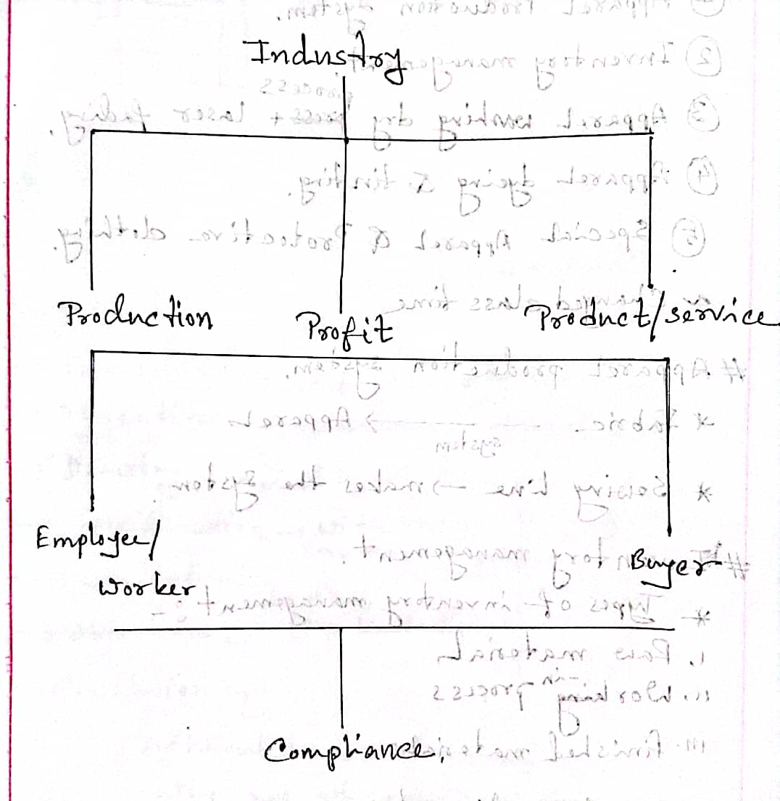

# Management & Organization

## Introduction to Industrial Management

### Management

Management is consists of,

1. Planning
2. Organizing
3. Leading
4. Controlling

> The more you manage yourself, the more control you have on others.

> A set of activities (planning, organizing, leading, and controlling) directed at an organization’s resources (human, financial, physical, and information) to achieve organizational goals in an efficient and effective manner.

### Industry & Industrial Management

**Organization:** Group of people + Specific Purpose + Infrastructure (Deliberate structure+ Organogram).

Organization involves input, processing & output and transforms a specific material into a finished product.

**Industry** is a place where product or services are produced for profit.

**Textile industry** is a place where a textile product or service is produced for profit.

University is an industry as it provides educational service to the students and profit is made through the success of students.

**Industrial Management** is the managerial process conducted in the industry.

### Types of Industrial Management

1. Production Management: Managing the production process of products.
2. Employee Management
3. Compliance Management: Maintaining compliance. For example, resolving conflicts, handle situations of equipment failures.

### Organizational Resources

Organizational resources are the physical, financial, informational, and human capacities of an organization. There are four types of organizational resources:

**1. Human Resources**

Human resources are the people who work for an organization in jobs that produce the products or services of the business or organization. It refers to managerial talent and labor.

Employees are considered in the most underrated Assets of any organization. They are important for the functioning of any organization, without which the activities of an organization will come to a standstill.

HR department is responsible for hiring of human resources via screening process.

**2. Financial Resources**

Financial resources are the funds used to acquire the human and material resources needed to provide products and services. It refers to capital investments to support ongoing and long-term operations.

Financial resources are important for the functioning of any organization. Financial resources are needed to pay salaries, purchase raw materials, and to meet other day-to-day expenses.

**3. Physical Assets**

Physical assets are the tangible and intangible assets an organization uses to produce goods or services. It refers to raw materials, office, production facilities, and equipment.

Physical resources are important for the functioning of the organization, since without things like equipment and inventory and manufacturing plant, it is difficult for the business to function.

**4. Information**

Refers to usable data. These data comes from the market, customers, competitors, and the organization itself. It is used to make decisions and to solve problems. It is also used to monitor and control the organization’s activities.

Classified information can be a blessing or curse for an organization depending on the situation. For example, a secret recipe that produces higher quality dye is desirable. But if there is something in the recipe that makes the dye unusable, the organization may have a hard time finding the reason for the problem, as there is no open feedback system.

### Kinds of Managers by Area

**1. Marketing Manager**

They work in areas related to getting consumers and clients to buy the organization’s products or services. They also work in new product development, promotion, and distribution.

Marketing managers focuses on increasing sales and introduces products that are desired by the customers. They also try to find new markets for the products and services.

**2. Financial Manager**

They deal primarily with an organization’s financial resources — accounting, cash management, and investments.

The main focus of financial managers is to increase the share value of the company. They sell shares and make investments to increase the price of shares.

**3. Operation Manager**

They are involved with systems that create products and services for example, production control, inventory, quality control, plant layout, site selection.

Operation manager solves bottlenecks to ensure smooth production. For example, in sewing line if a sewing a part of garments takes 10 minutes, but the next part takes 20 minutes, the operation manager will try to find a way to reduce the time of the second part. For this, he may set up two tables in the next part to split the workload.

# Reference

- Class lecture
- [marketing91.com](https://www.marketing91.com/four-types-of-business-resources/)
