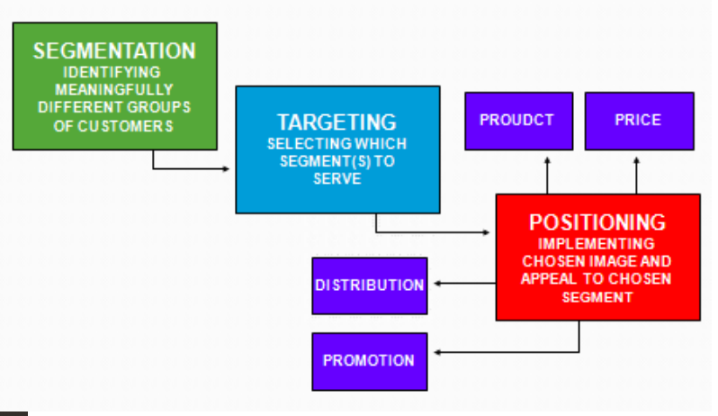
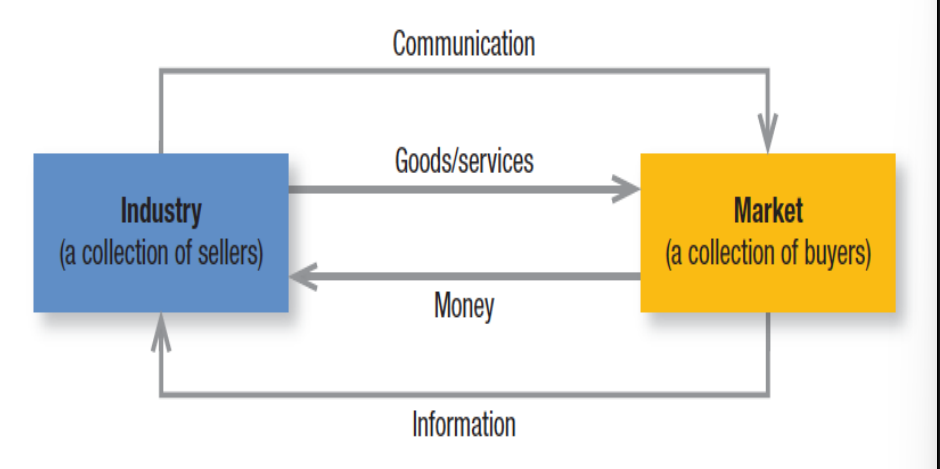
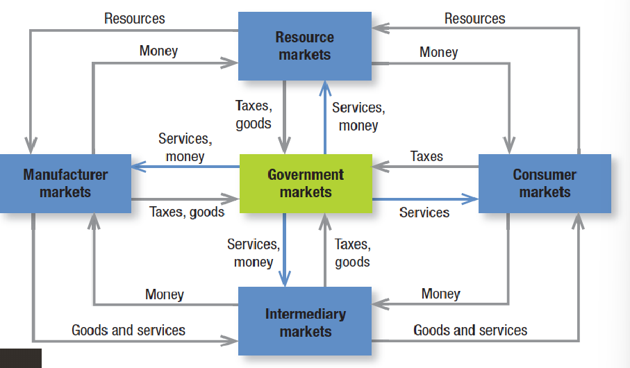
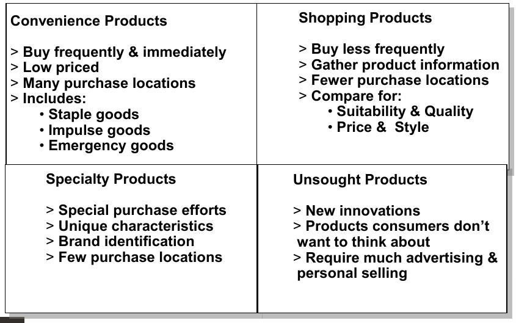

# Marketing Basics

## Outline

1. Why is marketing important?
2. What is the scope of marketing?
3. What are some core concepts of marketing?
4. What forces are defining the new marketing realities?
5. What new capabilities have those forces given to consumers and companies?
6. What does a Holistic marketing philosophy include?
7. What tasks are necessary for successful marketing management?

## Why is marketing important?

### The value of marketing

- Financial success often depends on marketing ability.
- Successful marketing builds demand for products and services, which, in turn, creates jobs.
  - For example, bottled water demand in Bangladesh has increased in present compared to past due to building up demand for bottled water.
- Marketing builds strong brands and loyal customer base, which is a major asset for any business.
- MySpace, Yahoo! etc. are replaced by Facebook, Google etc. because of their marketing ability and changing capacity.

## Scope of Marketing

AMA's formal definition of marketing:

> Marketing is the activity, set of institutions, and processes for creating, communicating, delivering, and exchanging offerings that have value for customers, clients, partners, and society at large.

The shortest definition of marketing is _meeting needs profitably_.

## Marketing Management

Peter Drucker says,

> There will always, one can assume, be a need for some selling. But the aim of marketing is to make selling superfluous. The aim of marketing is to know and understand the customer so well that the product or service fits him and sells itself. Ideally, marketing should result in a customer who is ready to buy. All that should be needed is to make the product or service available.

- Marketing management takes place when at least one party to a potential exchange thinks about the means of achieving desired responses from other parties.

## Elements which can be marketed

We are usually marketing goods and services, something tangible like laptops, and something intangible like services. But nowadays in the 21st century that notion is changed, there are a lot of products that we produced. Marketers market 10 main types of entities:

- Goods: Food items, cars, computers, etc.
- Services: Banking, hotel, airline, etc.
- Events: Trade shows, sports events, etc.
- Experiences: Walt Disney World, etc.
- Persons: Celebrity marketing, etc.
- Places: Cities, states, regions, etc. which are usually tourist destinations.
- Properties: Real estate, stocks, bonds, etc.
- Organization: Company, university, etc.
- Information: Books, magazines, etc.
- Ideas: Stop smoking, stop drinking, etc.

## Who markets?

A marketer is someone who seeks a response — attention, a purchase, a vote, a donation — from another party, called the prospect.

## Demand & 8 states of demand

Demand is 1. Having the desire for a product or service, 2. Having the ability to pay for it, and 3. Being willing to pay. We can say that the willingness to pay is the demand, as desire and ability comes before the willingness to pay.

### 8 States of Demand

1. Negative: Consumers dislike the product and may even pay a price to avoid it. Example: dental work, insurance.

2. Nonexistent: Consumers may be unaware or uninterested in the product. Example: new-to-the-world products such as a flying car or luxury cars.

3. Latent demand: Consumers may share a strong need that cannot be satisfied by an existing product. Example: safer neighborhood, more fuel efficient cars.

4. Declining demand: Consumers begin to buy the product less frequently or not at all. Example: fax machines, wired telephones.

5. Irregular demand: Consumer purchases vary on a seasonal, monthly, weekly, daily, or even hourly basis. Example: seasonal products such as air conditioners, heaters, and winter clothing.

6. Full demand: Consumers are adequately buying all products put into the marketplace. Example: clothing, food, and housing.

7. Overfull demand: More consumers would like to buy the product than can be satisfied. Example: tickets to a popular concert, housing in a desirable location.

8. Unwholesome demand: Consumers may be attracted to products that have undesirable social consequences. Example: cigarettes, hard drugs, and addictive gambling.

## Core marketing concepts

### Needs, Wants & Demands

**Need:** The state of deprivation is called need.

**Types of needs:**

- Stated needs: What the customer asks for. For example, an inexpensive car.
- Real needs: What the customer really means. For example, a car whose operating cost, not initial cost, is low.
- Unstated needs: The customer expects good service from the dealer.
- Delight needs: The customer would like the dealer to include an onboard GPS system.
- Secret needs: The customer wants friends to see him or her as a savvy consumer.

**Want:** Needs shaped by preference is called want.

**Demand:** It is 1. Having the desire for a product or service, 2. Having the ability to pay for it, and 3. Being willing to pay. We can say that the willingness to pay is the demand, as desire and ability comes before the willingness to pay.

### Target Markets, Positioning & Segmentation

**Segmentation:** Identification of distinct segments of buyers within a market by identifying demographic, psychographic and behavioral differences among them.

**Target Markets:** The segment(s) present the greatest opportunity for a particular product or brand.

### Value proposition, offerings, brands

**Value proposition:** The set of benefits or values it promises to deliver to consumers to satisfy their needs.

**Offerings:** A combination of products, services, information, or experiences offered to a market to satisfy a need or want.

**Brands:** An offering from a known source.

### Marketing channels

Three types of marketing channels:

**Communication:** Delivering and receiving messages from target buyers through media such as newspapers, television, radio, billboards, magazines, direct mail, telephone, fax, and internet.

**Distribution channels:** Displaying, selling, or delivering the physical product or service(s) to the buyer or user. It can include wholesalers, retailers, distributors, and the internet.

**Service channels:** Examples include warehouses, transportation companies, banks etc.

### Media

**Paid media:** Media that is paid for. For example, TV ads, radio ads, print ads, display ads, paid search, sponsorships, etc.

**Owned media:** Media that is owned by the company. For example, websites, blogs, social media pages, etc.

**Earned media:** Media that is earned by the company. For example, word of mouth, viral marketing, PR, etc.

### Others

**Impressions:** Occur when a consumer views a communication.

**Engagement:** The extent of a customer’s attention and active involvement with a communication.

**Value:** A combination of quality, service, and price (qsp) that is offered to customers.

**Satisfaction:** A person's judgment of a product's perceived performance in relationship to expectations.

**Supply chain:** A channel stretching from raw materials to components to final products that are carried to final buyers.

**Competition:** All the actual and potential rival offerings and substitutes a buyer might consider.

## Marketing Environment

Marketing environment consists of the actors and forces outside marketing that affect marketing management’s ability to build and maintain successful relationships with target customers. The marketing environment offers both opportunities and threats.

**Task Environment:** Consists of the immediate actors involved in producing, distributing, and promoting the offering.

**Broad Environment:** Consists of six components: demographic, economic, socio-cultural, natural, technological, and political-legal forces. Marketers must watch these trends and developments.

## A simple marketing system

Sellers send goods and services and communications such as ads and direct mail to the market; in return, they receive money and information such as customer attitudes and sales data.

The inner loop shows an exchange of money for goods and services; the outer loop shows an exchange of information

## Structure of Flows in a Modern Exchange Economy

Five basic markets and their connecting flows are shown in the figure.

**Manufacturers** go to resource markets (raw material markets, labor markets, money markets), buy resources and turn them into goods and services, and sell finished products to intermediaries, who sell them to consumers.

**Consumers** sell their labor and receive money, with which they pay for goods and services.

**The government** collects tax revenues to buy goods from resource, manufacturer, and intermediary markets and uses these goods and services to provide public services.

**Each nation’s economy**, and the global economy, consists of interacting sets of markets linked through exchange processes.

## Key customer markets

- Consumer markets:
  - Companies selling mass consumer goods and services such as soft drinks, cosmetics, air travel, and athletic shoes.
  - A strong brand image is developed by a superior product or service.
  - Ensures its availability and backing it with engaging communications and reliable performance.
- Business markets:
  - Companies selling business goods and services such as chemicals, machines, and services.
  - Advertising and websites can play a role, but the sales force, the price and seller's reputation may play a greater role.
- Global Markets:
  - Companies in the global marketplace navigate cultural, language, legal and political differences while deciding which countries to enter, how to enter, how to adapt product and service features to each country, how to set prices, and how to communicate in different cultures.
- Nonprofit and Governmental Markets:
  - Companies selling to nonprofit organizations with limited purchasing power such as churches, universities, charitable organizations, and government agencies need to price carefully.
  - Much government purchasing requires bids; buyers often focus on practical solutions and favor the lowest bid, other.

## The New Marketing Realities

### Technology

- The idea of _Information is power_ is converted to _Sharing information is the power._

### Globalization

- The world is becoming a global village.
- Companies can buy and sell in markets anywhere in the world.
- Countries are increasingly becoming multicultural.
- Companies take ideas and lessons from one country and apply them to another.
- Sellers can not sell any product from a specific brand with higher price than the original price, as due to technology, anyone can see what the actual price of the product is on the internet. This is an example of globalization. Even though brands like Adidas, Nike etc. are selling their products in Bangladesh, sellers can not sell it with higher price than the original price. Thus guaranteeing the original price of the product by the brand.

### Social Responsibility

- The private sector is taking some responsibility for improving living conditions, and firms all over the world have elevated the role of corporate social responsibility.
- Large companies take social responsibilities for their own benefits.
- Textile industries are taking responsibilities for environment pollution.
- CSR: Country Social Responsibilities.
  - Large companies have a separate department for CSR. They handle various social responsibilities triggers human emotions.
  - Human emotions are the most powerful tool for marketing & used by the CSR.
  - Parachute oil is a good example of social responsibility. They give 1% of their profit for the education.

## A dramatically changed marketplace

### New Consumer capabilities

- Drastically changing of human lifestyle changed consumer capabilities.
- Consumers can use the internet as powerful information and purchasing aid. For example, bloggers are providing reviews of products, various tourist spots, restaurants to let customers know about the product or place.
- Consumers can interact with the companies directly through various platforms.
- They can search, communicate, and purchase on
  the move.
  – They can tap into social media to share opinions and express loyalty.
- They can reject marketing they find inappropriate

### New Company Capabilities

- Can use the internet as powerful information and sales channel, including for individually differentiated goods.
  – Can collect fuller and richer information about markets, customers, prospects, and competitors.
  – Can reach customers quickly and efficiently via social media and mobile marketing, sending targeted ads, coupons, and information.
- One can not simply steal an idea.
- Can improve communication with customers.
- Can improve purchasing, recruiting, training, and internal and external communications
- Can improve cost efficiency.

### Changed market channels

- One of The Reasons Consumers Have More Choices Is That Channels Of Distribution Have Changed As A Result Of Retail Transformation And Disintermediation.
- Entrepreneurial Retailers Are Building Entertainment Into Their Stores With Coffee Bars, Demonstrations, And Performances, Marketing An “Experience” Rather Than A Product Assortment.
- Traditional Companies Engaged In Re-intermediation And Became “Brick-and-click” Retailers, Adding Online Services To Their Offerings.
- "Brick-and-click".
  - Click only companies are defined by Kotler are "The so-called dot-coms".
  - Companies are setting up websites to give information to the customers so that intermediaries can not take any illegal advantages.
  - Bricks And Clicks Model Is When A Chain Of Store Allows The Customer To Order Products Either Online Or Physically.
  - In One Of Their Stores, Also Allowing Them To Either Pick-up Their Order Directly.

### Heightened competition

- Heightened competition: More competition in the market.
- While Globalization Has Created Intense Competition Among
  Domestic And Foreign Brands, The Rise Of Private Labels And
  Mega-brands And A Trend Toward Deregulation And Privatization Have Also Increased Competition.

## Marketing Concepts

### Production concept

- Consumers will favor products that are available and highly affordable.
- Management should focus on improving production and distribution efficiency.
- Example: Ford Model T.

### Product concept

- Consumers will favor products that offer the most quality, performance, and features.
- Management should focus on making continuous product improvements.
- Example: Apple.

### Selling concept

- Consumers will not buy enough of the firm's products unless it undertakes a large-scale selling and promotion effort.
- Management should focus on finding the right customers, selling and promoting aggressively.
- Example: Life insurance.

### Marketing concept

- Achieving organizational goals depends on knowing the needs and wants of target markets and delivering the desired satisfactions better than competitors do.
- Management should focus on delivering superior customer value to their target markets.
- Example: Amazon.

### Holistically marketing concept

- The holistic marketing concept is based on the development, design, and implementation of marketing programs, processes, and activities that recognize their breadth and interdependencies.
- Designing marketing activities that deliver value to customers, shareholders, and society.
- Holistic marketing acknowledges that everything matters in marketing—and that a broad, integrated perspective is often necessary.
- Example: Toms shoes.

**Holistic marketing dimensions or components:**

1. _Internal Marketing:_ Products are given to the employees first, then to the customers. Because the employees are more likely to give honest feedback.
   - The task of hiring, training, and motivating able employees who want to serve customers well.
   - Includes marketing department, senior management, other departments.
2. _Integrated Marketing:_ All the marketing activities are integrated. Price is not the only factor to the consumers but also the quality, features, etc. are also considered.
   - Integrated marketing occurs when the marketer devises marketing activities and assembles marketing programs to create, communicate, and deliver value for consumers such that “the whole is greater than the sum of its parts.”
   - Includes communications, products & services, channels, price.
3. _Performance Marketing:_ Social responsibilities, legal, environmental, ethics etc. are considered.
   - Performance Marketing Requires Understanding The Financial And Nonfinancial Returns To Business And Society From Marketing Activities And Programs.
   - Includes sales revenue, brand & customer equity, ethics, environments, legal, social.
4. _Relationship Marketing:_ The management must have a good relationship with the employees, suppliers, etc. Having a good relationship with customers is not enough.
   - Relationships with people and organizations that directly or indirectly affect the success of the firm’s marketing activities.
   - Four key constituents for relationship marketing are customers, employees, partners (channels, suppliers, distributors, dealers, agencies), financial community (shareholders, investors, analysts).

**Q:** Selling concepts vs marketing concepts?

## Do purchase decision

Consumer decision-making process.

Depends on:

- **Need Recognition:** The buyer recognizes a problem or need. For example, a person needs a new mobile phone.
- **Information Search:** The buyer searches for information about the product or service that can solve the problem or need. For example, the person searches for mobile phones on the internet.
- **Evaluation of Alternatives:** The buyer evaluates the alternatives available in the market. For example, the person compares the features of different mobile phones.
- **Purchase:** The buyer selects a product or service. For example, the person selects a mobile phone.
- **Post Purchase Evaluation:** The buyer evaluates the product or service after purchase. For example, the person checks if the mobile phone is working properly or not.

## Four Ps of marketing

### Marketing mix four Ps

1. Product
2. Price
3. Promotion
4. Place

### Modern marketing management four Ps

1. People: reflects, in part, internal marketing and the fact that employees are critical to marketing success.
2. Processes: reflects all the creativity, discipline, and structure brought to marketing management.
3. Programs: reflects all the firm’s consumer-directed activities.
4. Performance: As Financial And Nonfinancial Implications (Profitability As Well As Brand And Customer Equity) And Implications Beyond The Company Itself (Social Responsibility, Legal, Ethical, And The Environment).

## Marketing management tasks

- Develop market strategies and plans
- Capture marketing insights
- Connect with customers
- Build strong brands
- Create value
- Deliver value
- Communicate value
- Conduct marketing responsibility for long-term success.

## Product Classifications

### Consumer Products

### Industrial Products

1. Materials and parts
2. Capital items
3. Supplies and services

# Reference

- Class Lecture
