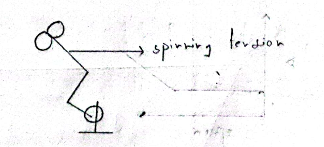
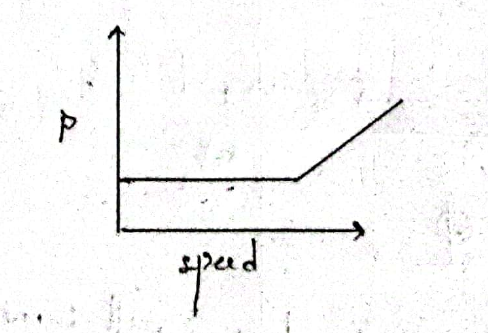
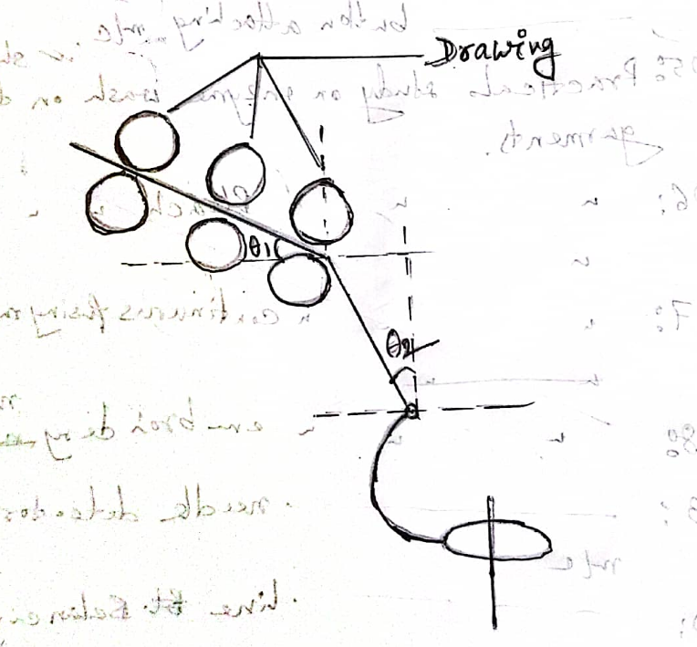

# Need of alternative spinning

## Introduction

1865 is the year of origin of **conventional spinning** or ring spinning.

80% of span yarn is ring spun yarn. Spun yarn is the yarn produced from staple fiber.

**Modern spinning** is also known as alternative spinning. Example of alternative spinning machines are rotor spinning, air jet spinning, friction spinning, wrap spinning, compact spinning etc. 1960 is the year of alternative spinning.

## Need of alternative spinning

Ring spinning technology has high cost and lower quality production. We'll discuss these two limitations in details.

## High Cost Limitation

### 1. Productivity is lower

**Number of ring frame required:**

Say we have to produce _hosiery yarn_ 30 tons/day with _Ne = 20._ The fibers have to go through,

- 1 Blowroom
- 12 Carding machines
- 8 1st Draw frames
- 8 2nd Draw frames
- 6 Simplex machines

Now to complete the process we need 25 ring frame. The number of ring frame is higher than any other machine. It is due to the productivity of ring frame is lower than any other machine.

Higher number of ring frame requirement will cause,

1. Lower productivity.

2. Higher investment cost in land, machine etc.

3. Higher running cost in power, labor, process etc.

4. Draft limitations: Roving frame is only needed to provide draft, which decreases count of sliver. Running of roving frame is not needed in rotor spinning, air jet spinning etc.

### 2. Production and spindle speed

We know $Productivity = \frac{spindle\:speed}{TPI}$ where TPI is turns per inch.

As TPI provides twist that gives strength to the yarn, we can't lower the number of TPI than a specific value. So the only way to increase the production is by increasing spindle speed.

Increasing spindle speed causes the following problems:

1. Increasing spindle speed will cause increase of spinning tension, due to which end breakage rate will increase.

   
   _Figure: Spinning tension in a ring frame._
   We can say tension $\propto$ spindle speed $^{2}$.

2. By increasing spindle speed, the friction between traveler and ring will increase. It will cause thermal deformation of traveler and destroy traveler finish due to heat generation.

3. With increase of spindle with power consumption will increase. So the cost of production will increase.

   

   _Figure: Power consumption vs spindle speed of ring frame_

### 3. Package Size

**Productivity:**

The package size of ring frame is 1.5 kg. It is very small. So the number of doffing is higher and requires a longer winding time as need to change input package of winding would be very frequent. It causes lower productivity.

**Spindle speed:**

$Package\:size \propto Ring\:dia^{2}$

Now, $Spindle\:speed \propto \frac{1}{\sqrt{ring\:diameter}}$.

So larger diameter of ring will cause lower spindle speed.

**Path of traveler:**

Larger ring diameter require larger linear path of traveler. Here $Linear\:speed\:of\:traveler\propto\:Ring\:diameter$ and $Yarn\:tension \propto Traveler \: speed ^{2}$. As a rresult,spinning yarn tension will increase causes higher breakage.

**Spinning geometry**

_Figure: Geometric restriction of ring frame_

In the figure, $\theta_1$ and $\theta_2$ can not be changed. It is the geometric restriction of ring frame. Ring diameter affects the geometric restriction. So ring diameter can not be changed too much.

## Lower Quality Production
