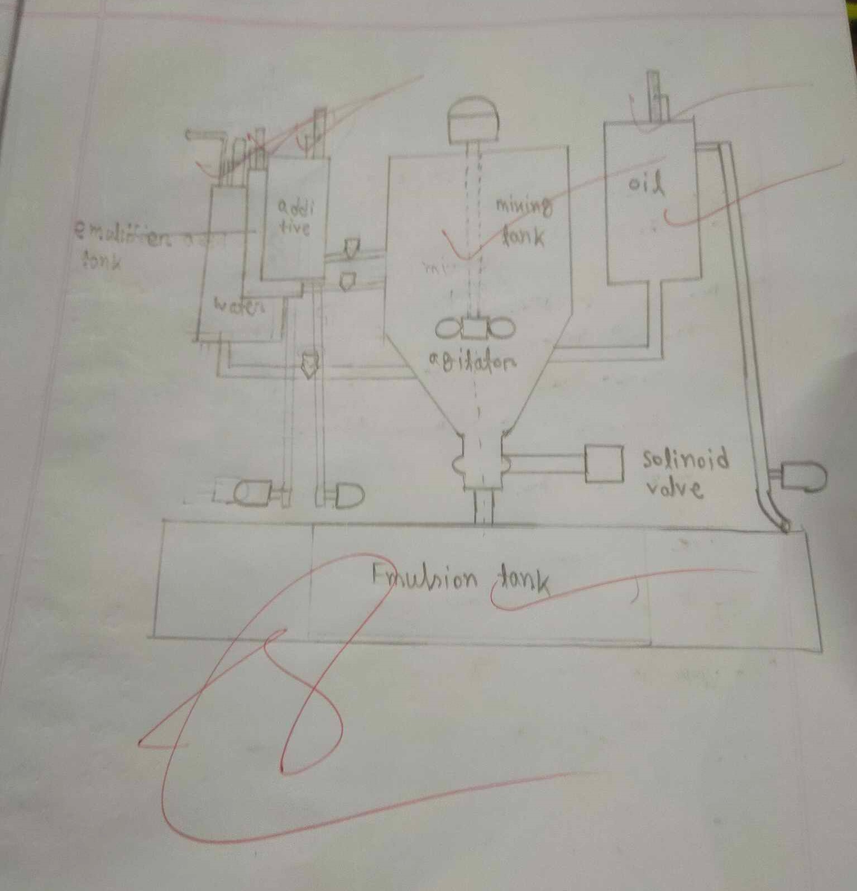

# Study on OD automatic batch mixing machine

**Date:** 16.07.23

## Introduction

## Main Parts

1. Water tank
2. Oil tank
3. Emulsion tank
4. Additives
5. Mining tank
6. Solenoid valve
7. Storage tank
8. Seals
9. Indicator

## Working procedure

_Figure: Diagram of OD automatic batch mixing machine (Work in progress)_

## Limitations

## Conclusion

## Notes

- **OD** refers to Ordinary.
- Jute consists of lignin, which gives makes it hard and brittle. It gets easily broken down due to abrasion and mechanical treatment.
- Jute is **emulsified** by adding emulsion to make it soft.
- Jute loses strength on water due to rotting. **Additives** are added to prevent rotting of jute and to increase strength. They can also be used as coloring agent.

### Emulsion recipe

1. Water - 89.5%
2. Oil - 10%
3. Emulsifier - 0.5%

**Water:**

Water may be soft to very hard depending on PPM of mineral content. PPM refers to parts per million (1 mg/l).

- Soft water: 0-60 PPM
- Moderately hard water: 61 - 120 PPM
- Hard water: 121 - 180 PPM
- Very hard: 181+ PPM

Soft water is used for emulsion.

**Oil:**

The oil used in emulsion is required to have,

- No smell, color or odor.
- Higher availability and should be available all time of the year.
- It also should be cheap.

_JBO_ or Jute Batching Oil is used in emulsion. But it has some limitations:

- Has smell of kerosene.
- Can cause caner.

But jute is largely used in packaging. So for non-food items, these limitations can be ignored.

But for food items, _JBO_ is not suitable has it has health hazards. The smell may be reduced, but the cancer causing effect can not be removed from _JBO_.

So, for food items, _RBO_ Rice Bran Oil is used. It has no smell or health hazards like _JBO_.

We use _JBO_ in our lab.

**Emulsifier:**

Lisapole is used as emulsifier. Emulsifier is a wetting agent that reduces surface tension to oil water emulsion stable temporarily.
