## Chapter Outline

- Definition
- Requirements of garments washing
- Types of garments washing
- Process (objectives, chemical name, chemical functions, flow process, standard recipe) of each washing type
- Washes
  1. Normal Wash
  2. Enzyme Wash
  3. Stone Wash
  4. Bleach Wash
  5. Sulphide Wash
  6. Acid Wash
  7. Pigment Wash
  8. Caustic Wash
  9. Silicon Wash

## Washing Definition

Garment washing is a technology which is applied to change or modify the outlook, appearance, comfortability, design and cleaning of garments.

## Types of Garments Washing

**1. Wet process/Chemical process:**

_where no chemical or washing machines are used._

- Normal wash/ garment wash/rinse wash
- Pigment wash
- Caustic wash
- Enzyme wash
- Stone wash
- Stone enzyme wash
- Super white wash
- Bleach wash
- Acid wash
- Silicon wash
- Soft wash

**2. Dry process/Mechanical process:**

_where chemical and washing machines are used._

- Sand blasting
- Whisker
- Hands brush
- Over all wrinkles
- Permanent wrinkle
- Broken and tagging
- Grinding and destroy
- PP spray and PP sponging etc.

## Objectives or requirements of Garments Washing

- To remove dirt, dust and waste materials from garments.
- To remove size materials from garments.
- Give soft hand feel.
- To improve outlook or appearance of garments.
- To improve color fastness and abrasion resistance property.
- To increase the brightness of garments.
- To increase the smoothness of garments.
- To make directly wearable after purchase.
- To remove harmful materials from garments.

## Wet Process

### Washing Chemicals

- Enzyme: Used in enzyme washing & hydrolyses the cellulose to remove color to produce fading effect.
- Detergent: Used in normal wash to remove dirt, dust, sizes and waste materials from garments.
- Acetic Acid ($CH_3COOH$): Neutralize the garments in alkaline condition.
- Anti staining agent
- Bleaching agent: Oxidizing agent.
- Sodium Hyposluphite ($Na_2S_2O_3$): Neutralize the garments in acidic condition.
- Caustic Soda ($NaOH$): Used in caustic wash to remove color from garments.
- Soda Ash($Na_2CO_3$): Creates alkaline medium for the breakdown of pigment dye.
- Sodium bicarbonate ($NaHCO_3$): Used in washing plant in the bleach bath with bleaching powder for Denim Light shade because it can easily color fade with in shot time.
- Potassium Permanganate ($KMnO_4$): Used in Acid wash with Pumice stone for color out from the garments.
- Softener: Imparts soft and silky feel.
- Micro emulsion silicon: Gives durable softness, lubricity, elastic handle, anti-pilling.
- Sodium Chloride ($NaCl$): It helps to exhaust dye in to the fiber.
- Buffer: Controls the pH of the bath.
- Hydrogen peroxide ($H_2O_2$): Breaks up and gives some per hydroxhyl ion, which discolor the coloring materials and as a result fading effect is developed.
- Stabilizer: used to protect break of hydrogen peroxide and it works in bath smoothly.
- Fixing agent: Used for unfixed dye to fix on fabrics.
- Optical brightener: used for improve the brightness of garments.
- Resin: Used for the creation of semi-permanent creases in denim and other cellulose fabrics.
- Sodium Meta Bi Sulphite ($Na_2S_2O_5$): Used in the washing plant to neutralized the garment from potassium permanganate.
- Desizing agent

### Machines Used in Washing Section

- Washing machine: Washing machine is the machine used to wash the various types of clothes without applying any physical efforts.
  - Types of washing machine:
    1. Front Loading Washing Machine.
    2. Side Loading Washing Machine.
    3. Vertical loading washing machine.
    4. Horizontal loading washing machine.
    5. Stone Washing Machine.
    6. Semi-automatic washing machine.
    7. Fully automatic machine.
- Hydro extractor
- Dryer
- Industrial Oven
- Boiler

### Standard Flow Process of Apparel Washing

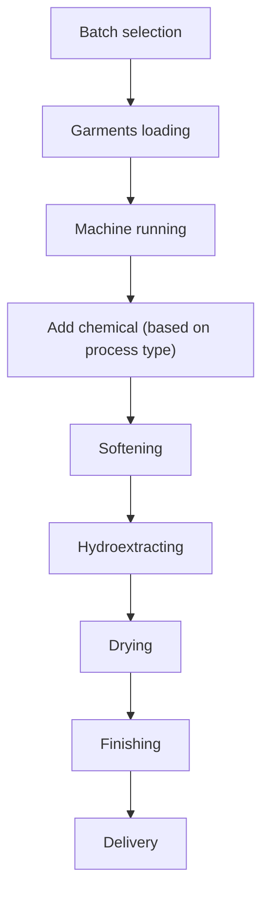

## Normal Wash (Wet Process)

### Flow Process

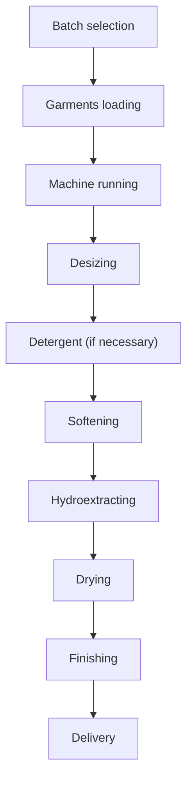

### Objectives

- To remove dust, dirt, oil spot, impurities from the garments.
- To remove size materials from the garments.
- For soft feeling to wear the garments after purchasing.
- To achieve buyer washing standard.

## Enzyme Wash

Enzymes are bio chemical substances that behave as catalysts toward specific reactions.

### Advantages or Objectives of Enzyme Wash

- "Bio-Polishing" effect of cotton/denim.
- Enzyme attack as chemically not mechanically for this reason low damage/wastage.
- For soft feeling to wear the garment. Enzyme attacks more the surface of the fabrics and gives a very smooth surface.
- To remove the size materials from the garments.
- To remove the starch presents on the garments fabrics.
- To achieve the buyer reference sample.
- To increase the color fastness & rubbing fastness.
- Enzyme improves the anti-pilling properties.

### Why Enzyme wash is preferred?

1. Enzyme attacks more the surface of the fabrics and gives a very smooth surface.
2. Enzyme attack as chemically not mechanically for this reason low damage/wastage.
3. Operate at low temperature.
4. Replace harsh chemicals.
5. Eco-friendly.

### Acid Enzyme vs Neutral Enzyme

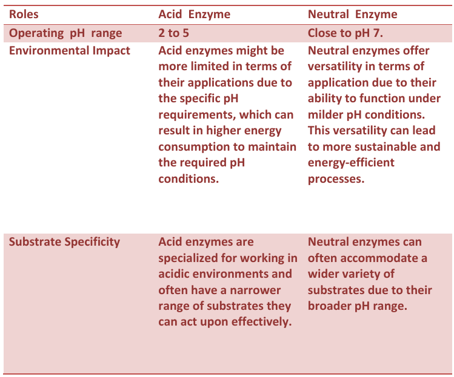

### Flow Process

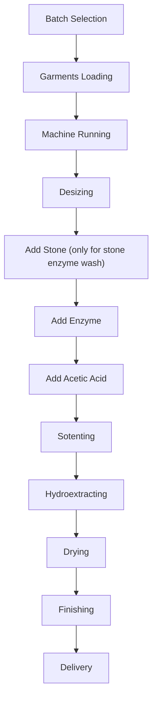

### Recipe

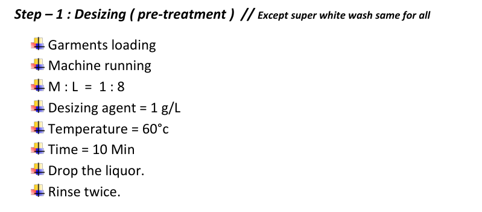
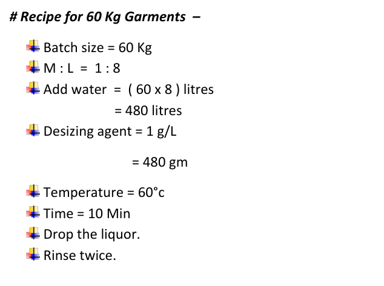
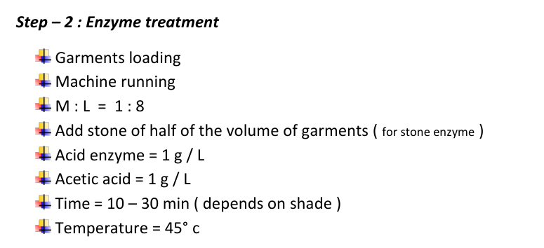
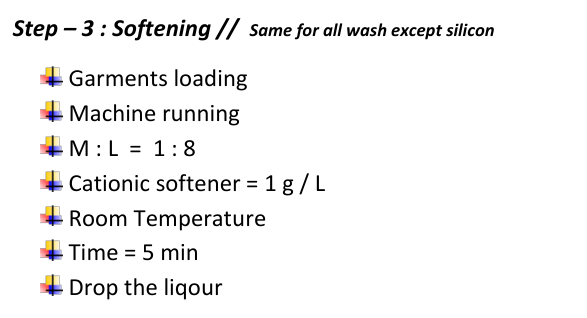
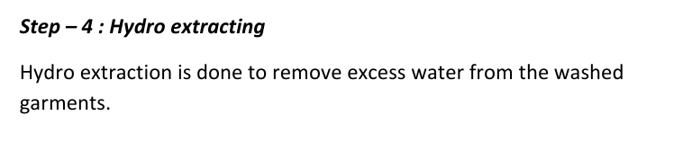

## Bleach Wash

### Objectives

- Destroy natural color.
- Rubbing fastness remove.
- Color fading.

### Flow Process

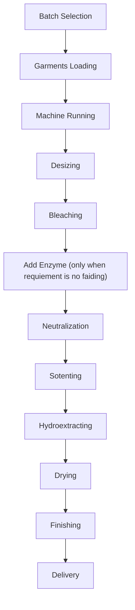

### Recipe

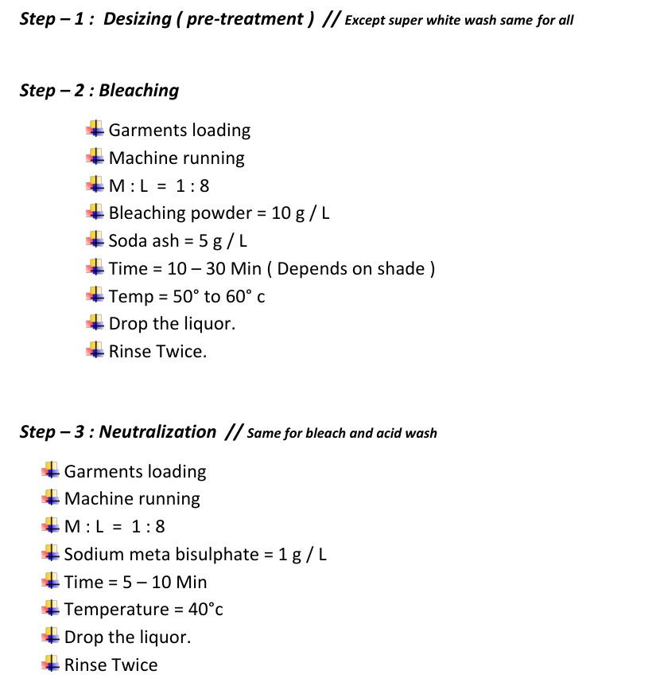
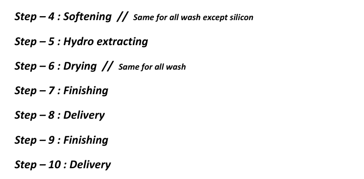

### Enzyme vs Bleach Wash

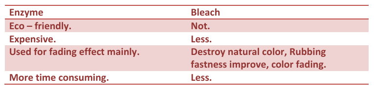

## Acid Wash

### Use of Pumice Stone

During Acid wash, pumice stones are used. By the action of pumice stones, irregular fading effect is developed on the heavy garments like denims, thick canvas/twill, and sweater.

The pumice stones act as a brushing action on the garment fabric surface. The area where more brushing action takes place; more discolor or fading effect is developed and the area where less brushing action takes place less fading effect will be developed.

The multi-layer fabric areas like – collar, calf, pocket, placket, side seam etc. area will be brushed more than the single layer areas.
As a result irregular fading affect will be developed on the garments' fabric surface. In this way, fading affect may be developed on the
garments by acid wash technique.

**Usage of KMnO4 with pumice stone:**

Pumice stones are soaked with KMnO4 ; chemical stays on stone surface which give effect.

Without stone only KMnO4 will give uniform fading effect which is not desirable ; for irregular fading stone is used. As in machine, stone comes with surface contact of fabric irregularly & irregular fading is obtained which is desirable.

**Advantages of pumice stone:**

- Desired vintage effect on garments can be easily achieved by using pumice stones.
- Washed garments can achieve more soft effect by using pumice stones.

**Disadvantages of pumice stone:**

- Can be damaged washing machine due to stone and machine abrasion.
- Garments can be damaged due to stone and machine abrasion.

### Objectives:

- Irregular fading.
- Buyer requirement.
- For soft feeling to wear the garments i.e. to improve softness.
- To increase rubbing fastness.
- To remove dust, dirt, oil spot, impurities from the garments.
- To remove size materials from the garments.

### Flow Process

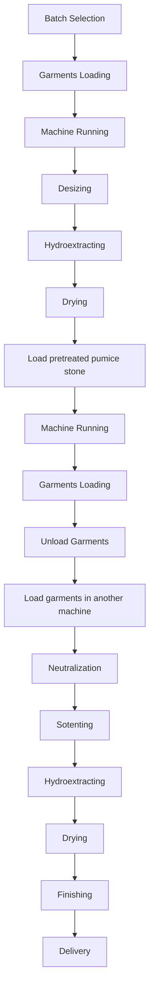

### Questions

**Q1: After loading pumice stone why machine runs before loading garments?**

Stone needs to soak with chemical KMnO4; then put in to machine. Before loading garments machine runs so that chemical can spread into
machine uniformly. After that it is ready for operation.

**Q2: Why load garments into another machine?**

Previous machine is filled with KMnO 4 which is an oxidizing agent. It produces fading in fabric. Next step is neutralization ; if same machine is used we need to remove KMnO4 first.
It will be a time consuming process. So use of another machine will be time efficient.

### Recipe

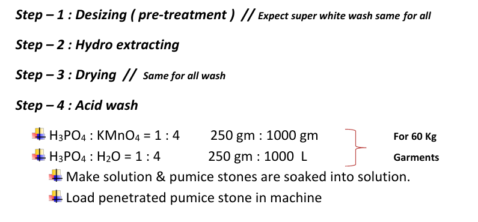

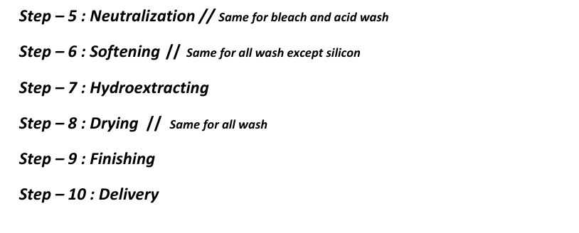

### Factors of Fading

- RPM of machine.
  - More RPM = More fabric surface will be fade.
  - Less RPM = Less fabric surface will be fade.
- Squeeze & pressure (knit)
- Less squeeze bandage ; less chemical ; less effect
- Time
- Concentration

## Flow process of pigment, caustic & silicon wash

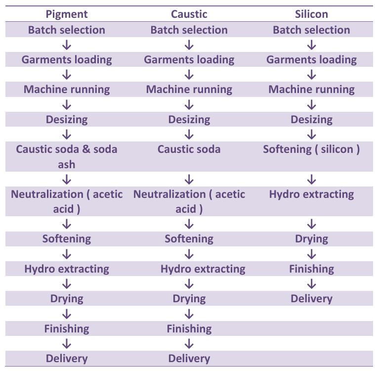

## Pigment Wash

Its similar to normal washing process and applicable for pigment dyed fabric.

### Objectives

- To wash pigment dyed fabric.
- To give color fading effect.
- To remove dust, dirt, oil spot, impurities from the garments.
- To remove size materials from the garments.
- For soft feeling to wear the garment after purchasing.
- To increase the color and rubbing fastness.
- To achieve buyer washing standard.

### Recipe

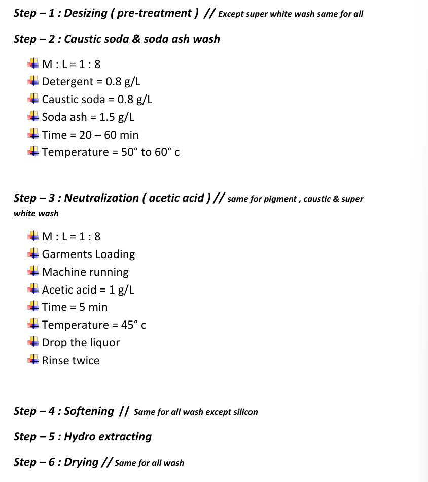

## Caustic Wash

Normally printing on fabric is done after pre-treatment that is desizing, scouring & bleaching.

But for caustic wash, printing is done without pre-treatment.

### Objectives

- To fading/old looking effect on Garment and seam abrasion affection seam area.
- To remove the size materials, starch from the garments.
- Dust, dirt, oil spot, impurities etc. are removed that may come from during process i.e. cutting, stitching and the back process.
- To increase the color fastness & rubbing fastness.
- For soft feeling to wear the garments.
- To increase the hairiness on garments this increases its old look appearance.
- To achieve the buyer reference sample.

### Recipe

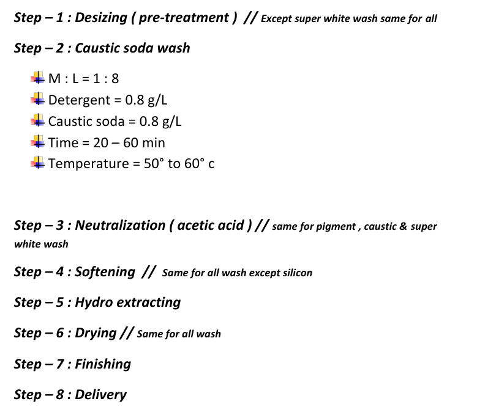

## Silicon Wash

Silicon washes are generally done on all type of fabrics.

### Objectives

- It gives durable softness, elastic handle,
- It helps to anti pilling affects, dimensional stability, tear resistance.
- It helps to fabrics to be cut and sewn more easily allows.
- Improve wears and easy care properties.

### Recipe

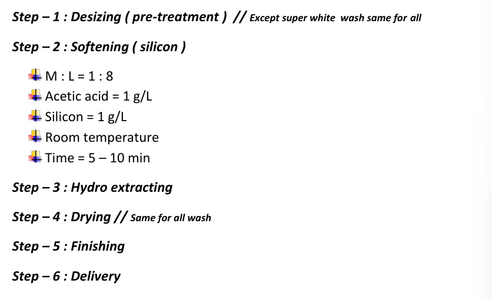

## Super White Wash

_To be added._

## Washing Parameter/Condition

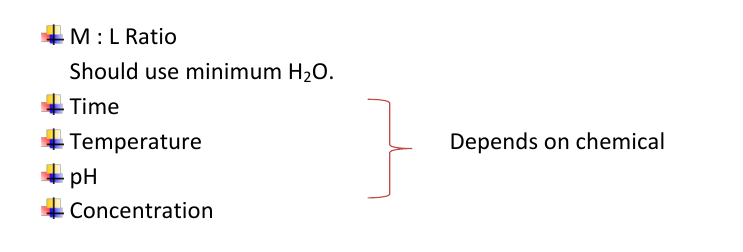

## Washing Faults

- Bleach spot
- Over grinding
- Shade variation
- Crease mark
- After wash hole
- Poor brightness
- Poor handfeel
- High low effect
- High hairness
- Over blasting
- Spot on garments
- Bad smell due to poor neutralization

## Prevent of back staining

- Use limited softener
- Use anti-staining agent
- Use better dye

## Contributions

- Shakib Hasan Shuvo
