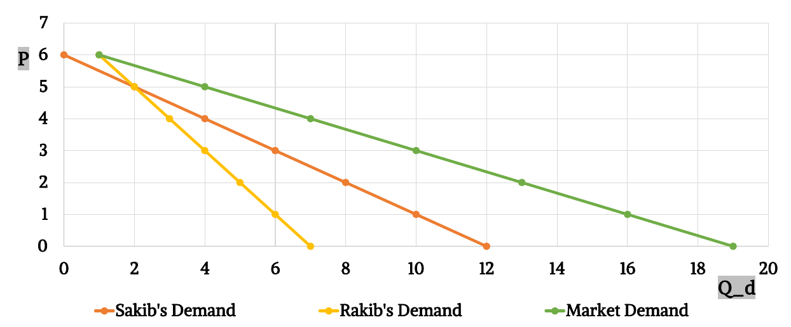
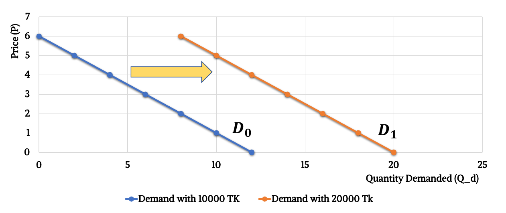

## Demand Curve

- **Law of Demand:** Ceteris paribus, the quantity demanded of a good falls when the price of the good rises.
- **Ceteris paribus:** All other things being equal or unchanged.
- **Price vs. Quantity demanded:**
  
- **Demand equation or function:**
  - $Q_D = 12 - 2P$ or $P = 6 - \frac{1}{2}Q_D$. Note that here $Q_D$ and $P$ are inversely related (opposite sign).
  - Where, $Q_D$ is the quantity demanded and $P$ is the price.
  - $y = mx+c$ where $m$ is the slope which indicates if price rises by 1 unit, quantity of cones demanded falls by 2 units.
- **Intercepts:**
  
  - Vertical intercept shows consumer’s reservation price, which is his/her highest willingness to pay for that good.
  - Horizontal intercept shows the quantity at which consumers total utility is maximum & marginal utility is 0.

### Individual demand vs. Market demand

- If individual demands are $Q_1$ & $Q_2$ then market demand is $Q_1 + Q_2$.
- Graphically,
  
- Mathematically, if $Q_{D1} = 12 - 2P$ and $Q_{D2} = 8 - 2P$ then $Q_{MD} = Q_{D1} + Q_{D2} = 20 - 4P$.

### Demand shifters:

- **Income of consumers:**
  - Normal good: A good A good for which, other things being equal, an increase in income leads to an increase in demand Example: Coffee, shirt, movie ticket etc. Rightward shift if increase in income for normal goods.
    
  - Inferior good: A good for which, other things being equal, an increase in income leads to a decrease in demand. Example: Bus rides, instant noodles etc. Leftward shift if increase in income for inferior goods. Leftward shift if increase in income for inferior goods.
    
- **Price of related goods:**
  - Substitutes: two goods are substitutes if the products could be used for the same purpose by the consumers, so that having more of one good causes the consumer to desire less of the other good. Demand of a product rises (curve shifts right) when price of its substitute rises causes a rightward shift in demand curve.
  - Complements: A complementary good is a product or service that provides value to another product or service, so that having less of one good causes the consumer to desire less of the other good. Demand of a product falls (curve shifts left) when price of its complement rises causes a leftward shift in demand curve.
- **Consumer tastes & preferences:** Leftward shift in case of fall in taste or preference.
- **Expectation of consumers:** When consumer expects a higher price in future, his/her demand for that product increases at present & demand curve shifts to the right.
- **Market size/Number of buyers:** When more people want to purchase a product/service, at that time, market demand for that good/service rises & the demand curve shifts to the right.

## Supply Curve

- **Law of Supply:** Ceteris paribus (other things
  being unchanged), the quantity supplied of a good rises when
  the price of the good rises.
- **Price vs. Quantity supplied:**
  
- **Supply equation or function:**
  - $Q_S = P - 1$ or $P = Q_S + 1$. Note that here $Q_S$ and $P$ are directly related (same sign).
  - Slope 1 indicates if price rises by 1 unit, quantity of cones supplied rises by 1 unit.

### Individual supply vs. Market supply

- If individual supplies are $Q_1$ & $Q_2$ then market supply is $Q_1 + Q_2$.
- Graphically,
  
- Mathematically, if $Q_{S1} = P - 1$ and $Q_{S2} = P - 2$ then $Q_{SM} = Q_{S1} + Q_{S2} = 2P - 3$.

### Supply shifters

- **Input prices:** When labor/capital/raw material/transport etc. price falls, production cost declines. Supply is increased to gain more profit. Supply curve shifts to the right.
- **Production technology:** When technology improves, productivity rises or production cost declines. Supply is increased. Curve shifts to the right.
- **Expectation of sellers:** When seller expects a higher price in future, his/her supply for that product decreases at present & supply curve shifts to the left.
- **Market size/Number of sellers:** When more suppliers enter in the market & want to sell a product/service, at that time, market supply for that good/service rises & the supply curve shifts to the right.

## Acknowledgement

- **Reference:** Class Lecture
