## Equilibrium

- **Market equilibrium:** One point at which the supply and
  demand curves intersect.
- **Equilibrium price:** At the equilibrium price, the quantity of the good that buyers are willing and able to buy exactly balances the quantity that sellers are willing and able to sell. It is called the market-clearing price because, at this price, everyone in the market has been satisfied: Buyers have bought all they want to buy, and sellers have sold all they want to sell.
- **Equilibrium Quantity:** The quantity supplied, and the quantity demanded at the equilibrium price. So, $Q_D = Q_S$.
  - Graphically,
    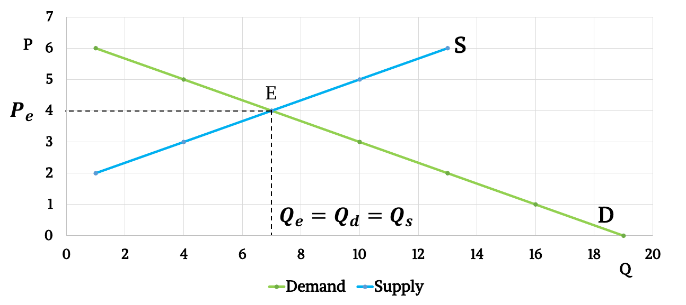
  - Mathematically,
    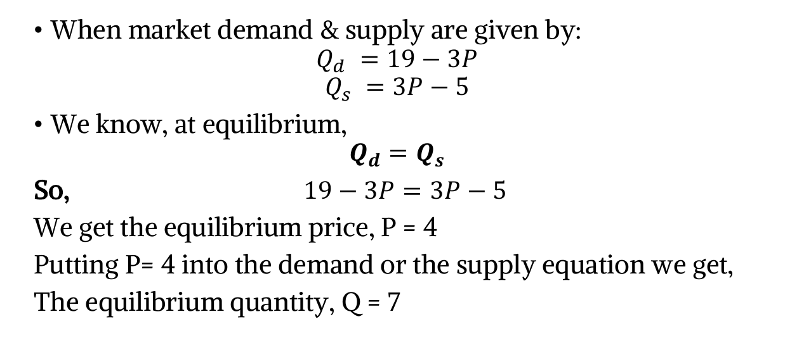
- **Surplus or excess supply:** When the market price is higher than equilibrium price, quantity supplied is greater than quantity demanded, $Q_S > Q_D$ This is called surplus or excess supply.
  - Graphically,
    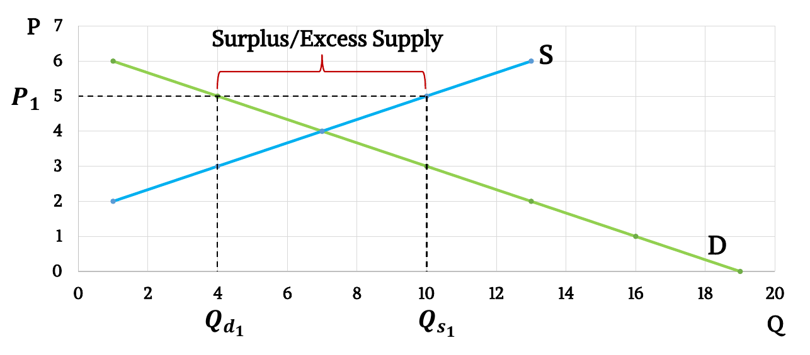
- **Shortage or excess demand:** When market price is higher than equilibrium price, quantity demanded is greater than quantity supplied, $Q_D > Q_S$ This is called shortage or excess demand.
  - Graphically,
    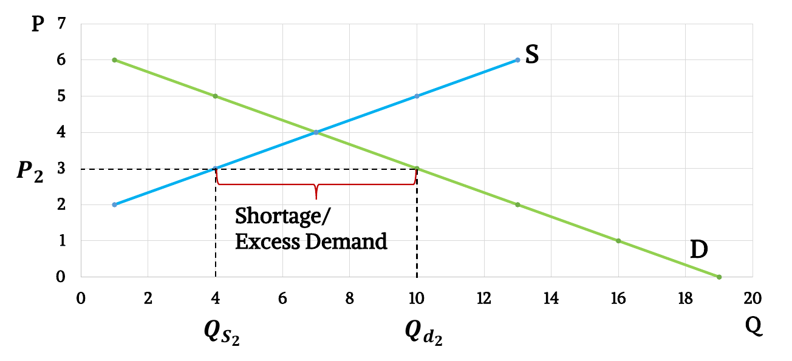
- **Self Correcting Mechanism of a free market:** The actions of buyers and sellers naturally move markets toward the equilibrium of supply and demand.
  - A free market/competitive market returns to the
    equilibrium – self correcting mechanism.
  - An Invisible hand (benefit maximizing behavior of
    buyers & sellers) drives this self-correcting mechanism.
  - If market Price is set above the equilibrium, benefit maximizing behavior of buyers & sellers gradually pulls it down towards the equilibrium.
  - If market Price is set below the equilibrium, benefit maximizing behavior of buyers & sellers gradually pulls it up towards the equilibrium.

## Change in Market Equilibrium Due to Changes in Demand & Supply

### Either Change in Demand or Supply

- **Demand Rise:** Following the effect of any shifters, when demand rises, the demand curve shifts rightward. As a result, with unchanged supply, equilibrium price increases as well as equilibrium quantity.
  - Graphically,
    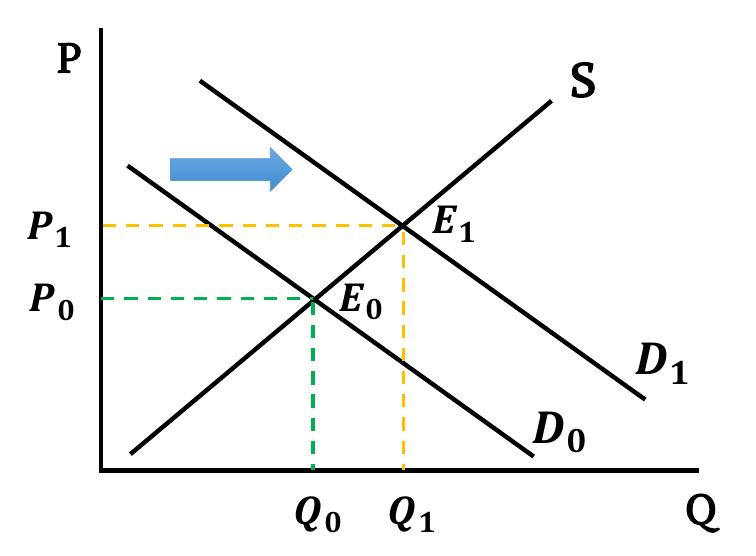
- **Demand Falls:** Following the effect of any shifters, when demand falls, the demand curve shifts leftward. As a result, with unchanged supply, equilibrium price decreases as well as equilibrium quantity.
  - Graphically,
    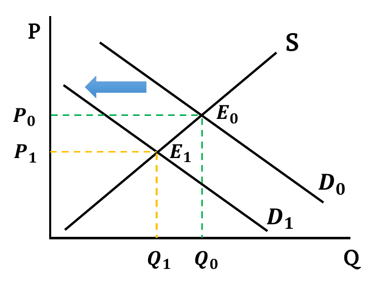
- **Supply Rises:** Following the effect of any shifters, when supply rises, the supply curve shifts rightward. As a result, with unchanged demand, equilibrium price decreases but equilibrium quantity increases.
  - Graphically,
    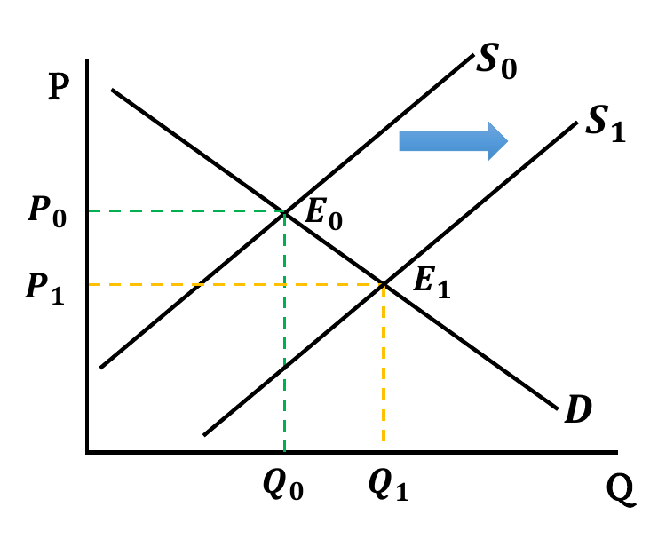
- **Supply Falls:** Following the effect of any shifters, when supply falls, the supply curve shifts leftward. As a result, with unchanged demand, equilibrium price increases but equilibrium quantity decreases.
  - Graphically,
    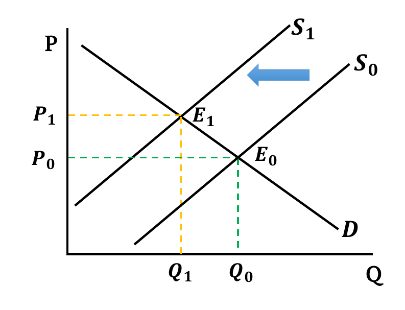

### Change in Both Demand & Supply

- **Both Increases:** Both Demand & Supply curves shift rightwards. New equilibrium quantity is greater than before ($Q_1 > Q_0$). Change in equilibrium price is ambiguous. It depends on the relative change between demand & supply.
  - When the shift in supply and demand is the same,
    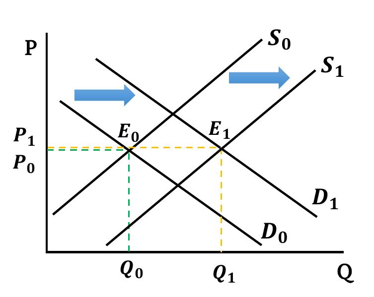
    - If both changes have equal effect, equilibrium price remains the same ($P_1 = P_0$).
  - When demand shift more than the supply,
    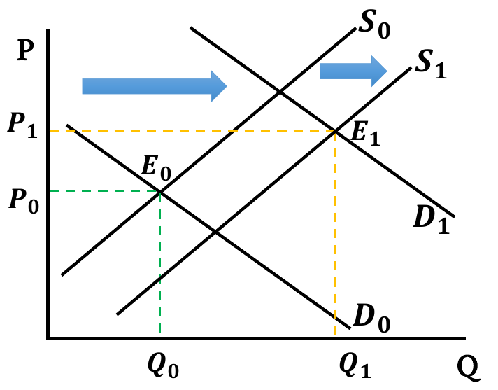
    - If rise in demand has a greater effect compared to rise in supply, equilibrium price increases ($P_1 > P_0$).
  - When supply shift more than the demand,
    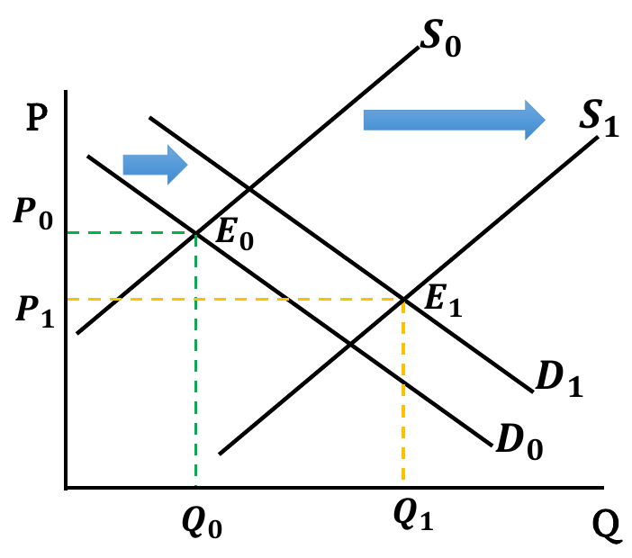
    - If rise in supply has a greater effect compared to rise in demand, equilibrium price decreases ($P_1 < P_0$).
- **Both Decreases:** Both Demand & Supply curves shift leftwards. New equilibrium quantity is less than before ($Q_1 < Q_0$). Change in equilibrium price is ambiguous. It depends on the relative change between demand & supply.
  - When the shift in supply and demand is the same,
    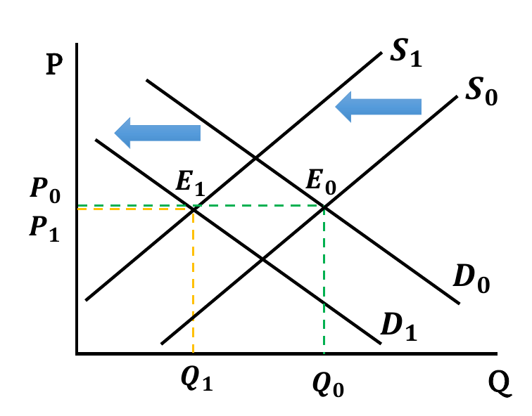
    - If both changes have equal effect, equilibrium price remains the same ($P_1 = P_0$).
  - When demand shift more than the supply,
    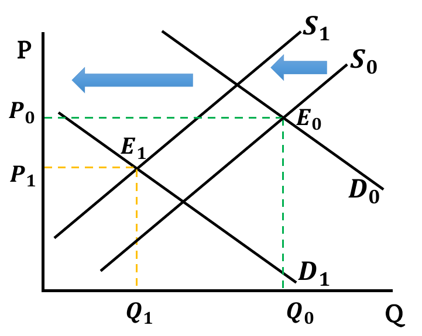
    - If fall in demand has a greater effect compared to fall in supply, equilibrium price decreases ($P_1 < P_0$).
  - When supply shift more than the demand,
    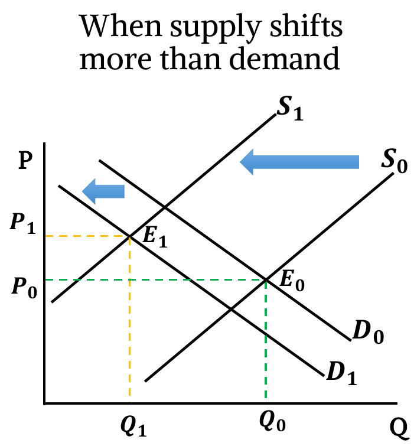
    - If fall in supply has a greater effect compared to fall in demand, equilibrium price increases ($P_1 > P_0$).
- **Demand Rises & Supply Falls:** Demand curve shifts rightward & Supply curve shifts leftward. New equilibrium price is higher than before ($P_1 > P_0$). Change in equilibrium Quantity is ambiguous. It depends on the relative change between demand & supply.
  - When the shift in supply and demand is the same,
    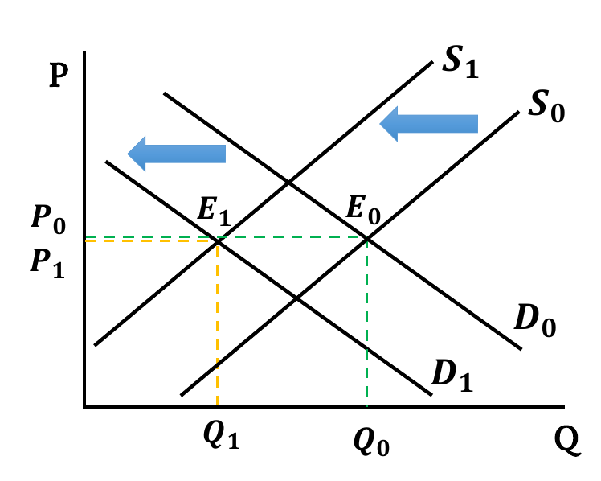
    - If both changes have equal effect, equilibrium quantity remains the same ($Q_1 = Q_0$).
  - When demand shift more than the supply,
    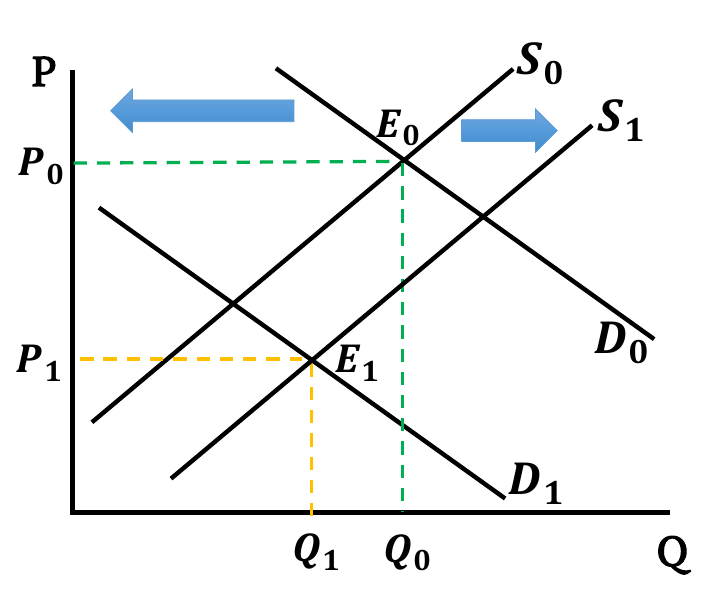
    - If rise in demand has a greater effect compared to fall in supply, equilibrium quantity increases ($Q_1 > Q_0$).
  - When supply shift more than the demand,
    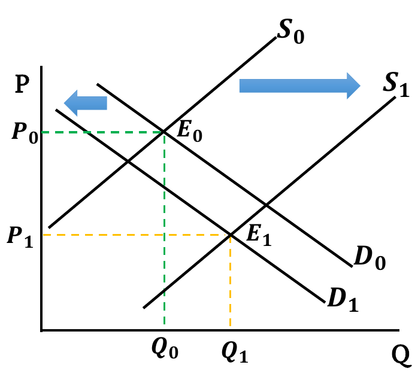
    - If fall in supply has a greater effect compared to rise in demand, equilibrium quantity decreases ($Q_1 < Q_0$).
