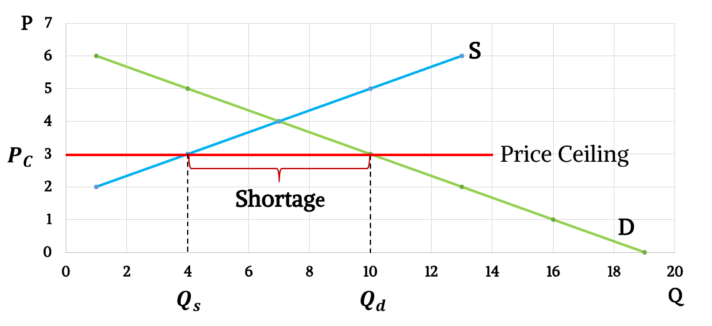
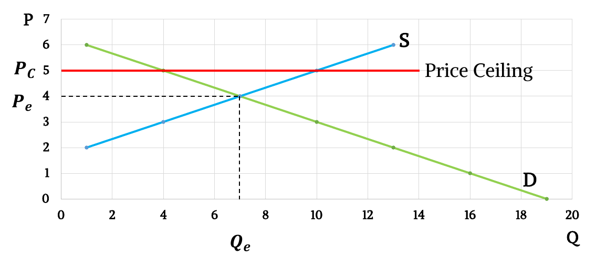
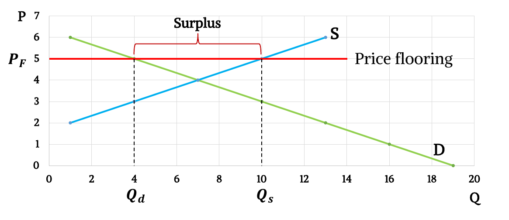
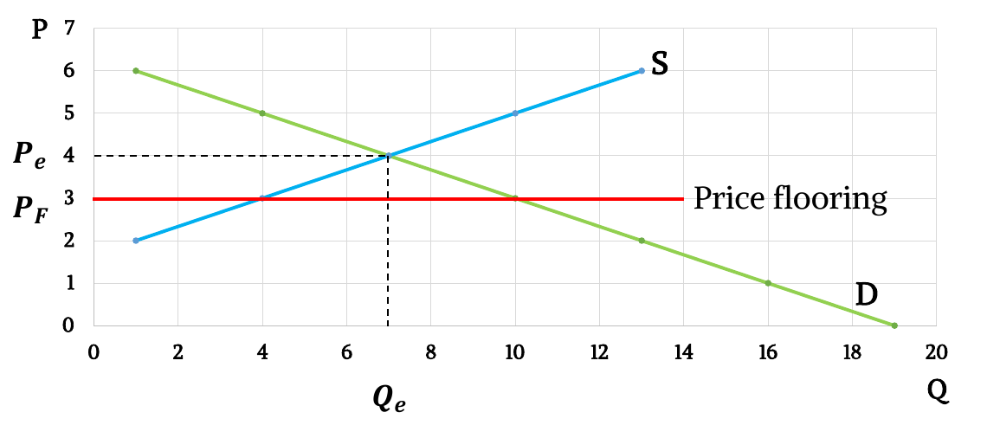
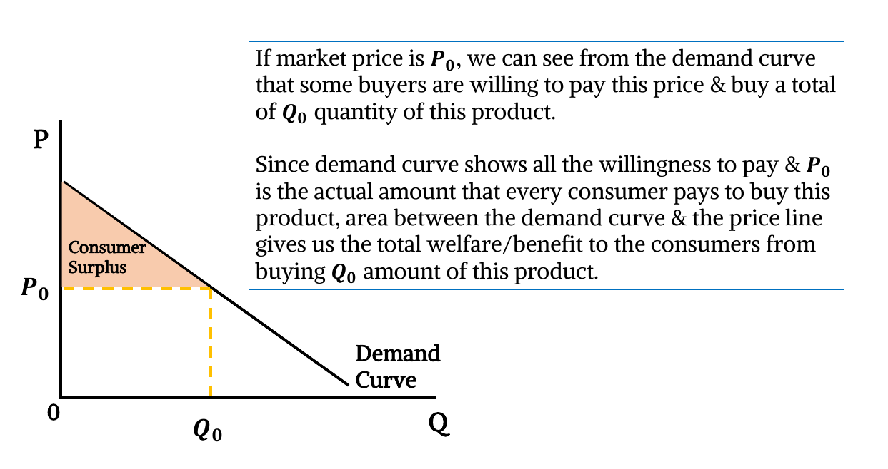
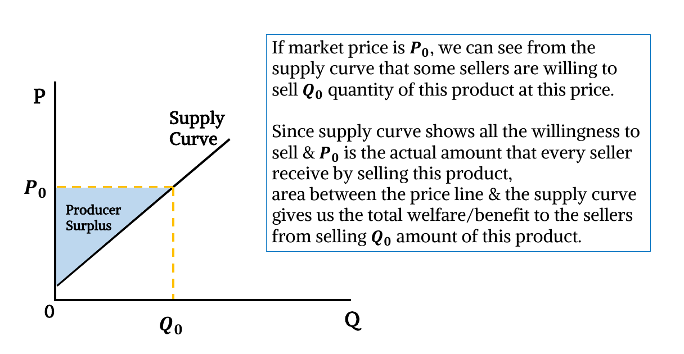
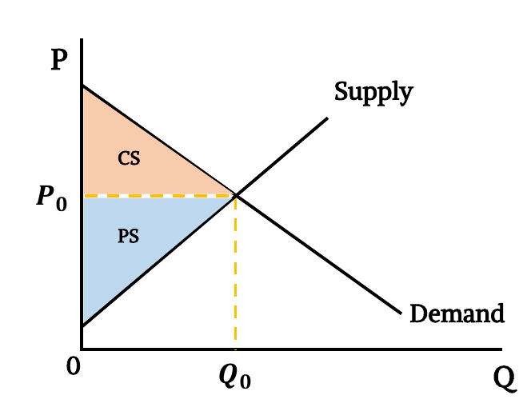
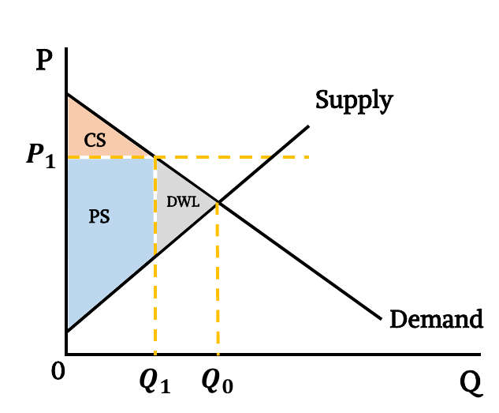
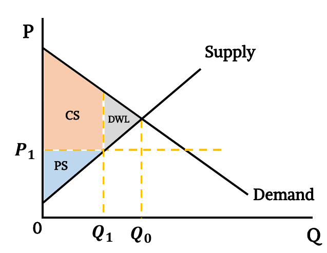

> What happens to market outcomes when Government imposes legal constraints on price?

## Price Ceiling & Price Flooring

- **Price Ceiling:** A legal maximum on the price at which a good can be sold.
  - **Binding price ceiling:** A price ceiling that is below the equilibrium price. A shortage of the good arises, and sellers must ration the scarce goods among the large number of potential buyers.
    
  - **Non-binding price ceiling:** A price ceiling that is above the equilibrium price. Market forces move the economy to the equilibrium, and the price ceiling has no effect on the price or the quantity sold.
    
- **Price Floor:** A legal minimum on the price at which a good can be sold.
  - **Binding price floor:** A price floor that is above the equilibrium price. A surplus of the good arises, and it can lead to undesirable rationing mechanisms.
    
  - **Non-binding price floor:** A price floor that is below the equilibrium price. Market forces move the economy to the equilibrium, and the price floor has no effect on the price or the quantity sold.
    

## Economic Welfare & Market Efficiency

- The price that balances the supply and demand is, in a particular sense, the best one because it maximizes the total welfare of a product’s consumers and producers. No consumer or producer aims to achieve this goal, but their joint action directed by market prices moves them toward a welfare-maximizing outcome, as if led by an invisible hand.
- **Willingness to pay:** The maximum amount that a buyer will pay for a good. It measures how much that buyer values the good. Represented by his/her demand curve.
- **Consumer Surplus:** The amount a buyer is willing to pay for a good minus the amount the buyer actually pays for it. Measures the benefit that buyers receive from a good. Thus, consumer surplus is a good measure of economic well-being if policymakers want to satisfy the preferences of buyers.
  - Graphically,
    
  - Fall in price increases consumer surplus.
  - Rise in price decreases consumer surplus.
- **Willingness to sell:** The minimum amount that a seller will receive as payment for a good. It measures the seller's cost of producing the good. Represented by his/her supply curve.
- **Producer Surplus:** The amount a seller is paid for a good minus the seller’s cost of providing it. Measures the benefit that sellers receive from participating in a market. Thus, producer surplus is a good measure of economic well-being if policymakers want to satisfy the interests of sellers.
  - Graphically,
    
  - Fall in price decreases producer surplus.
  - Rise in price increases producer surplus.
- **Total Surplus:** Welfare to the society or Total Surplus, $TS = CS+PS$. Free markets produce the quantity of goods that maximizes the total surplus. Thus, allocation from a free market is efficient.
  - Graphically,
    

## Welfare on Price Ceiling & Price Floor

- **Price Flooring is imposed (binding):**
  
  - A legal minimum price at P1 causes a surplus in the market. Q1 amount of the product is sold.
  - New CS has a smaller value, while new PS has a larger value.
  - TS is less than equilibrium.
  - Lost TS is called the Deadweight loss.
  - A non-binding price floor has no effect on the market outcome.
- **Price Ceiling is imposed (binding):**
  
  - A legal maximum price at P1 causes a shortage in the
    market. Q1 amount of the product is sold.
  - New CS has a greater value, while new PS has a smaller value.
  - TS is less than equilibrium.
  - Deadweight loss is created due to the price ceiling.
  - Again, a non-binding price ceiling has no effect on the market outcome.
