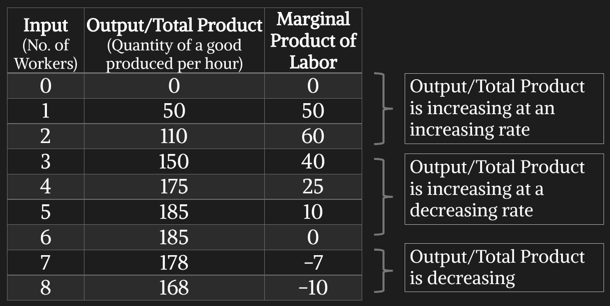
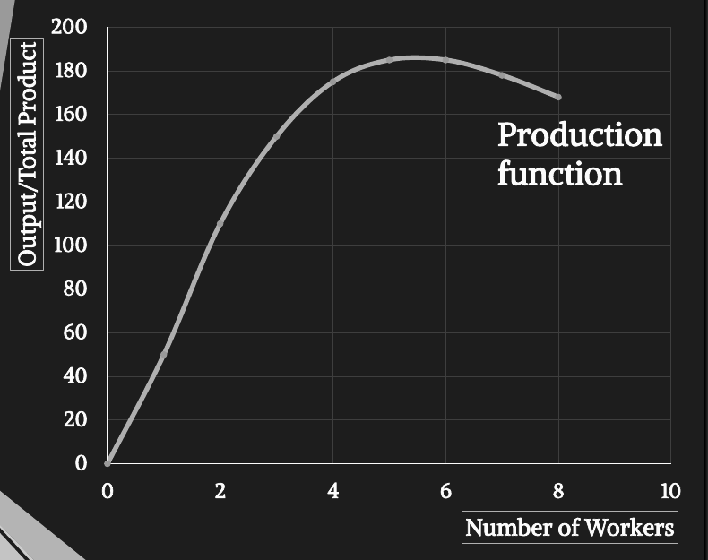
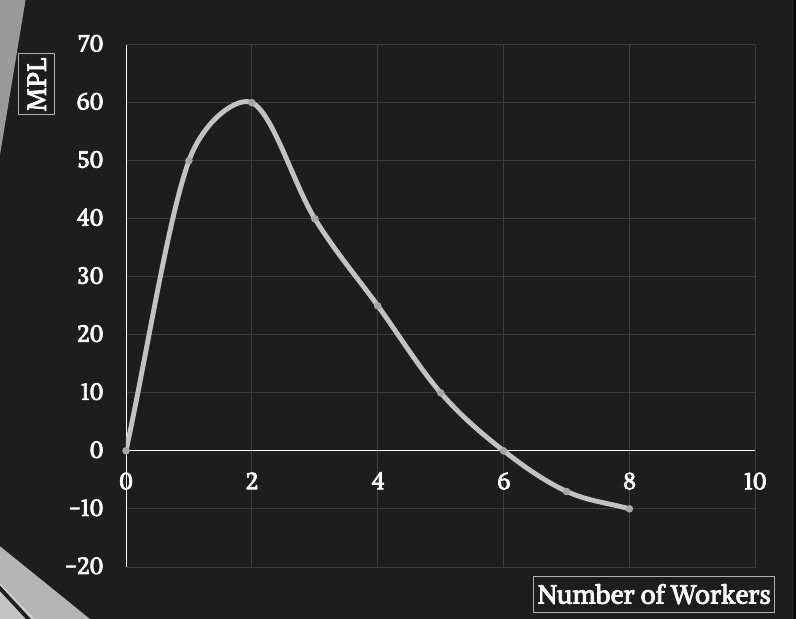
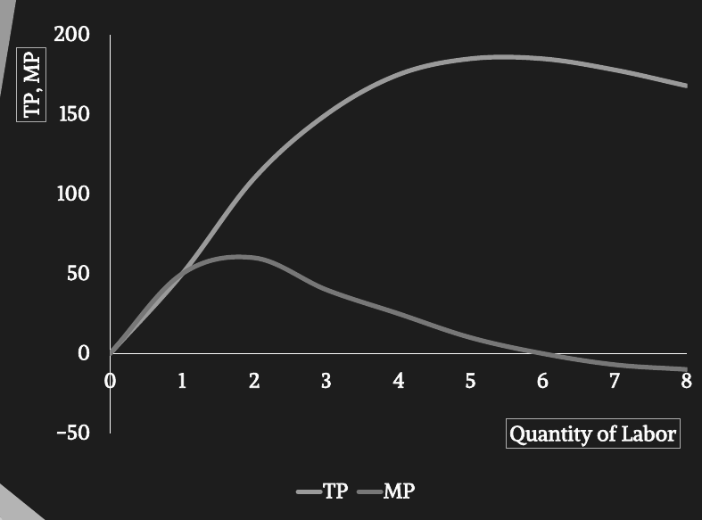
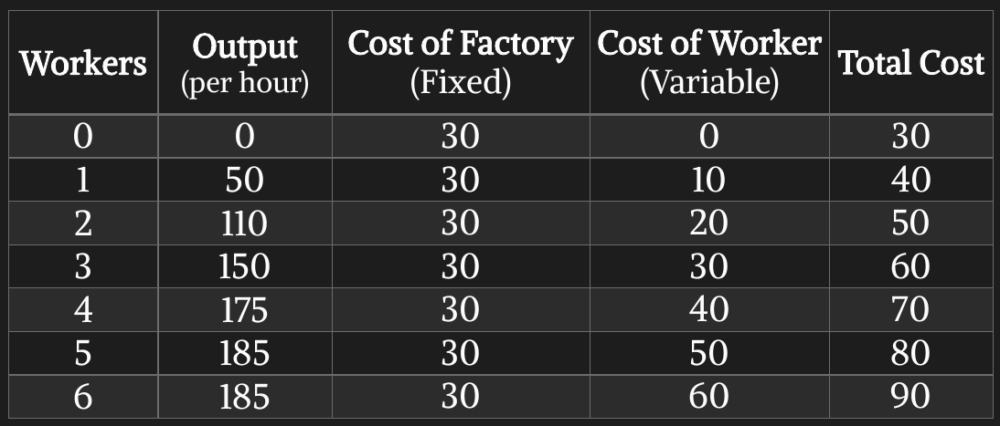
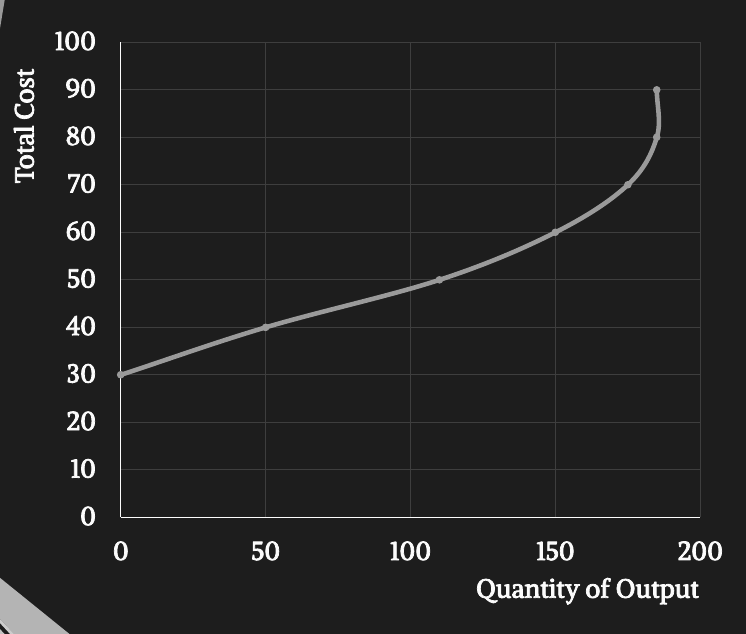
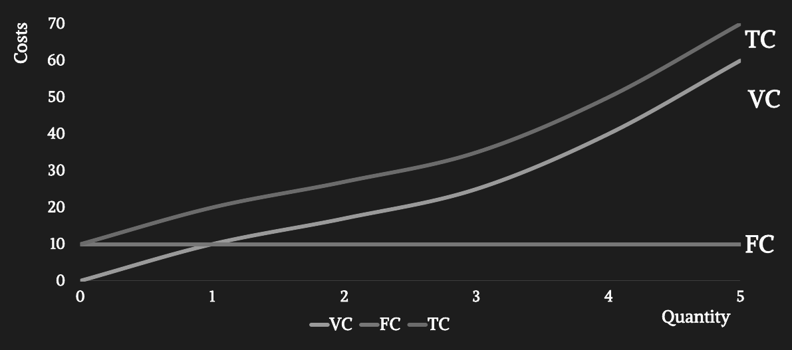
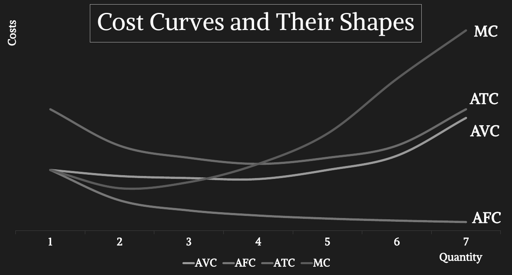
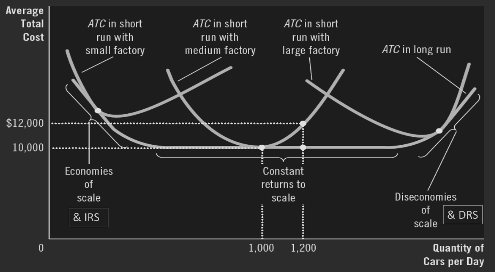

## Resources

- **Resources:** Two types of resources are used in production:
  1.  **Fixed Resources:** Can’t be changed as we produce more. At least not in the short run. Example: pizza oven, sewing machine, warehouse
  2.  **Variable Resources:** Can be changed with increasing production. Example: number of workers, ingredients.
- A company is in the short run when they have at least
  one fixed resource.
- In the long run, all resources are variable. Long run
  represents what could potentially happen in the future.
- **Costs:**
  1. **Fixed costs:** Costs that do not vary with the quantity of output produced. They are incurred even if the firm produces nothing at all. Example: rent of outlets, electric bills etc.
  2. **Variable costs:** Costs that vary with the quantity of output produced. Example: wages of workers, payments of raw materials & tools.
- **The Production Function:** It is the relationship between the quantity of inputs used to make a good and the quantity of output of that good.

  - In short run: $Q = f(L)$
  - In Long run: $Q = f(L, C)$

## Marginal Product

- **Marginal Product:** The increase in output that arises from an additional unit of input. It increases at first at an increasing rate, then increases at a decreasing rate, then finally decreases.
  
- **Diminishing Marginal Product:** Indicates the property whereby the marginal product of an input declines as the quantity of the input increases.
  - At first, when only a few workers are hired, they have easy access to equipment. As the number of workers increases, additional workers must share equipment and work in more crowded conditions. Eventually, it becomes so overcrowded that workers often get in each other’s way. Hence, as more workers are hired, each extra worker contributes fewer additional output to total production.
- **Law of Diminishing Marginal Returns:** In the short run, production increases at first due to specialization. But specialization has its limits.
  > Continuously addition of variable resources to fixed resources will cause the additional output to eventually decrease.
- **Production Curve:**
  
- **Marginal Product of Labor:**
  
- **Production Curve & Marginal Product:**
  
- **Total Cost:**
  
  

## Profit & Revenue

- **Profit:** Profit = Total revenue – Total cost
- **Total Revenue:** The amount that the firm receives for the sale of its output.
  - It equals the quantity of output the firm produces multiplied by the price at which it sells its output. ($TR= P \times Q$)
- **Total Cost:** Amount that the firm pays to buy inputs that are used in production. Two types of costs in economic terms:
  1. **Explicit costs:** Input costs that require an amount of money spent by the firm. Example: paying workers, buying raw materials, paying bills.
  2. **Implicit costs:** Input costs that do not require an amount of money spent by the firm. Example: forgone earning of the owner from an alternative job, forgone earning of a return from investing financial capital.
- Two types of profits based on costs:
  1. Accounting Profit = Total Revenue – Total Explicit Cost
  2. Economic Profit = Total Revenue – Total Opportunity
     (Explicit + Implicit) Cost
  - Usually, Accounting Profit > Economic Profit.

## Measures of Cost

- **Total Cost (in Short run):** Sum of variable cost & fixed cost. $TC =VC+FC$
- **Average total cost:** Total cost divided by the quantity of output. $ATC = \frac{TC}{Q}$
- **Average fixed cost:** fixed cost divided by the quantity of output. $AFC = \frac{FC}{Q}$
- **Average variable cost:** variable cost divided by the quantity of output. $AVC = \frac{VC}{Q}$
- **Marginal cost** = Change in total cost/Change in quantity. $MC = \frac{\Delta TC}{\Delta Q}$ or $MC = \frac{d}{dQ}(TC)$
- **Cost curve of TC, VC, FC:**
  
- **Cost curve of MC, ATC, AVC, AFC:**
  
  - Notice the U-shaped ATC curve. We know ATC = AFC + AVC. AFC decreases constantly as output increases. But AVC increases as output increases. The rate of rise of AVC is eventually increases as a result it becomes dominant. Thus, ATC curve is U-shaped.
- **Relationship between ATC & MC:**

  - When MC < ATC, ATC is falling.
  - When MC>ATC, ATC is rising
  - This leads to an important feature: “MC curve crosses the ATC curve at its minimum.” Therefore, MC=ATC at the minimum of ATC.

- Relationship between Short Run & Long Run ATC:
  

## Returns to Scale

**Returns to scale** shows what happens to production in the long run.

- **Increasing returns to scale:** if inputs are doubled, output
  becomes more than double.
- **Constant returns to scale:** if inputs are doubled, output
  doubles.
- **Decreasing returns to scale:** if inputs are doubled, output
  becomes less than double.

## Economies & Diseconomies of Scale

**Economies & Diseconomies of Scale** shows what happens to cost in the long run.

- **Economics of Scale:** It occurs when long run ATC falls as the quantity of output increases.
  - **Causes:**
    - Due to specialization among workers, average labor
      cost of producing each unit of that good falls.
    - Firms can use highly productive machinery, which can
      bring down the average cost of producing each unit.
    - Firms can adapt different cost saving measures when it
      goes to large scale production.
  - In the long run, ATC will not always be falling with increasing quantity of output. After reaching a certain minimum level, average cost will stay the same as output rises. The firm will face constant returns to scale in production in this phase.
- **Diseconomies of Scale:** It occurs when long run ATC rises as the quantity of output rises. (Getting even bigger is now expensive).
  - Firms incur diseconomies of scale because of
    coordination problems that often occur in a large
    organization.
  - When companies become too big, they then need to
    hire managers, buy land. At that phase, increasing
    output is causing the long run ATC to rise.
- Concepts like economies of scale help producers to make decisions. They don’t tell producers exactly how much to produce.

## Example Math

- **Math 01:** If $TC = Q^3 - 6Q^2 + 240Q + 750$ then what is VC, FC, AVC, AFC & MC? At which production quantity ATC will be minimum, and what would be the value of ATC?
  - $TC = Q^3 - 6Q^2 + 240Q + 750$
  - $VC = Q^3 - 6Q^2 + 240Q$
  - $FC = 750$
  - $AVC = \frac{VC}{Q} = \frac{Q^3 - 6Q^2 + 240Q}{Q} = Q^2 - 6Q + 240$
  - $AFC = \frac{FC}{Q} = \frac{750}{Q}$
  - $MC = \frac{d}{dQ}(TC) = \frac{d}{dQ}(Q^3 - 6Q^2 + 240Q + 750) = 3Q^2 - 12Q + 240$
  - $ATC = \frac{TC}{Q} = \frac{Q^3 - 6Q^2 + 240Q + 750}{Q} = Q^2 - 6Q + 240 + \frac{750}{Q}$
  - At minimum ATC, $MC = ATC$
    - => $3Q^2 - 12Q + 240 = Q^2 - 6Q + 240 + \frac{750}{Q}$
    - => $2Q^2 - 6Q - \frac{750}{Q} = 0$
    - => $Q^3 - 3Q^2 - 375 = 0$
    - => $Q = 15$
  - At minimum ATC Q = 15, so cost = $Q^2 - 6Q + 240 + \frac{750}{Q} = 15^2 - 6 \times 15 + 240 + \frac{750}{15} = 375$
