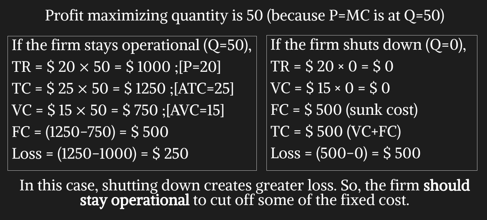

## Introduction

- **Features of a Perfectly Competitive Market:**
  - Many buyers and many sellers in the market.
  - Goods offered by the various sellers are almost identical.
  - Firms can freely enter or exit the market.
  - Firms are price takers.
- Like most other firms in the economy, a firm in a competitive market tries to maximize profit.
- Because the firm is small compared with the whole market, it takes the price as given by market conditions. This means that the price of the good does not depend on the number of goods that a competitive firm produces and sells.

## The Revenue of a Competitive Firm

If a competitive firm produces a quantity of ‘Q’, and sells unit at the market price ‘P’, then,

- Their total revenue, $TR = P \times Q$.
- Average Revenue, $AR = \frac {TR}{Q} = \frac {P × Q}{Q} = P$.
- Marginal Revenue, $MR = \frac{d}{dQ}(TR) = \frac{d}{dQ}(P \times Q) = P$.
- Average revenue tells us how much revenue a firm receives for the typical unit sold. Marginal revenue tells us the change in total revenue from an additional unit sold. Clearly, here MR = AR = P.

## Demand curve facing a Competitive firm

- A single firm in the competitive environment is insignificantly small compared to the whole market.
- It can’t change the market price to gain more profit. All the quantity is demanded from this firm is at that exact price.
- So, the firm will face a demand curve which is flat/perfectly elastic at the price line.
- Therefore, $P = MR = AR = D$
- Here the demand curve faced by the competitive firm is horizontal at the market price ‘PM ’.

  

- If the market price increases or decreases, the demand facing the competitive firm will also shift up or down.

## Profit Maximization for the Competitive Firm

- In a competitive market, unit price for product remains the same any quantity.
- Hence, marginal revenue (revenue from an extra gallon sold) is constant.
- Here, the change in profit is the change in revenue minus the change in cost, which is MR-MC.
- MC is increasing with production while MR remains constant
- For the initial quantities of production (such as $Q_1$ ), MR>MC (MC curve lies below the MR curve). Thus, change in profit is positive.
- After a certain quantity of production, MC > MR (MC curve will rise above the MR curve as it is increasing). Thus, change in profit becomes negative.
- Therefore, at a certain quantity $MR=MC$ where the curves will intersect. At that exact quantity, change in profit is 0. That will be the profit maximizing quantity, $Q_{Max}$. Increasing or decreasing production from that point will only bring less profit.
- As long as marginal revenue exceeds marginal cost
  (MR > MC at $Q_1$ ), increasing the produced quantity raises
  profit.
- If MR < MC (at $Q_2$ ), the firm should decrease production.
- At the profit-maximizing level of output ($Q_{Max}$), $MR=MC$.
- Profit is maximized at the output where, MR=MC.
- So, we can say, profit maximizing condition for a
  competitive firm is P=MC.
- If P > MC, the firm should increase production.
- If P < MC, the firm should decrease production.

## Competitive Firm’s Production Decision on Market Price Change

- When market price rises to P1 from P0, profit maximization condition requires that firm should increase production from Q0 to Q1 (P1 = MC at Q1)
- Similarly, the firm should produce Q2 amount of the product when its market price falls to P2. (P2 = MC at Q2)
- When price of the product rises, quantity produced by the firm also increases. When market price falls, quantity produced decreases. Which means, Quantity has a positive relationship with price. This is the exact relation we found from the law of supply & in the supply curve. Therefore, we can come to an understanding that MC curve is in fact the firm’s supply curve.

## Competitive Firm’s Profit

- $Profit = TR - TC = (\frac{TR}{Q} - \frac{TC}{Q}) \times Q = (P - ATC) \times Q$.
- The firm produces $Q_0$ at which $P=MC$.
- $TR = P_0 \times Q_0$
- $TC= ATC \times Q_0$
- $Profit = (P_0 -ATC) \times Q_0$, which is shown by the green area.

## Shut Down

- A shutdown refers to a short-run decision not to produce anything during a specific period of time.
- Consider the following two cases.

  

  - For case 1:

    

  - For case 2:

    

- If the firm shuts down, it loses all revenue from the sale of its product. At the same time, it saves the variable costs of making its product but must still pay the fixed costs.
- Thus, the firm shuts down if the revenue that it would earn from producing is less than its variable costs of production.
- Firm should shut down if TR < VC or $\frac{TR}{Q} < \frac{VC}{Q}$ or P < AVC (if price less than average variable cost).
- Also the firm will not produce any quantity below its AVC. For any price below the AVC, quantity produced is 0. Therefore, firm’s short run supply curve will be the portion of MC curve which is above its AVC.

  

## Entry & Exit Decision in the Long Run

- In the long run, there is no sunk cost (fixed cost). All costs are variable.
- Exit means shutting down production & leaving the business altogether.
- If the firm exits, it will lose all revenue from the sale of its product, but now it will save not only its variable costs of production but also its fixed costs.
- Thus, the firm exits the market if the revenue it would get from producing is less than its total cost of production.
- **Exit Rule:** TR < TC or $\frac{TR}{Q} < \frac{TC}{Q}$ or P < ATC (if price less than average total cost).
- **Entry Rule:** P > ATC.
- If the price is less than the average total cost at that quantity, the firm chooses to exit (or not enter) the market. Therefore, the competitive firm’s long-run supply curve is the portion of its marginal-cost curve that lies above the average-total-cost curve.

  

### A competitive firm earns zero economic profit in the long run.

- A market begins in long run equilibrium, earning 0 economic profit.

  

- Increase in demand raises the market price.

  

  - Since P > ATC, the firm is earning a positive profit.

- Profits induce entry of new firms in this market. (no. of sellers increase)
- Thus, market supply increases, resulting in a decrease in market price.

  

  - Falling market price again equals firm’s average cost (P = ATC).
  - As the short run economic profit diminishes, the new firm’s entry stops. This is how, in the long run, firms earn zero economic profit.

- Similarly, a short run economic loss due to decrease in market demand causes the exit of some existing firms. Fewer number of firms causes fall in supply which in turn raises the market price & restores long run equilibrium where firms again earn zero economic profit.

## Acknowledgement

- **Reference:** Class Lecture
