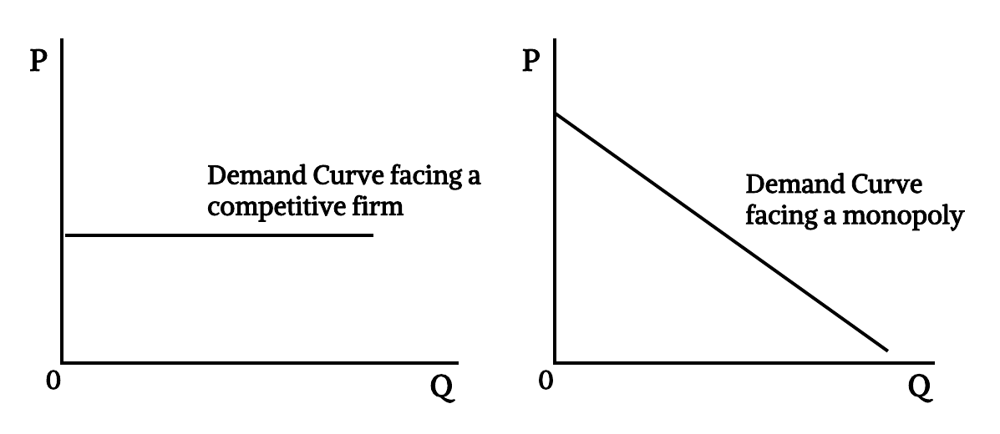
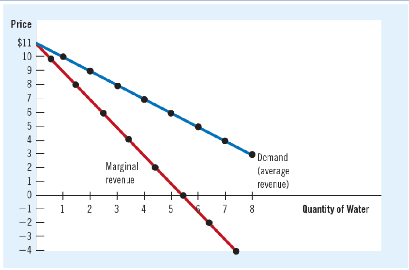
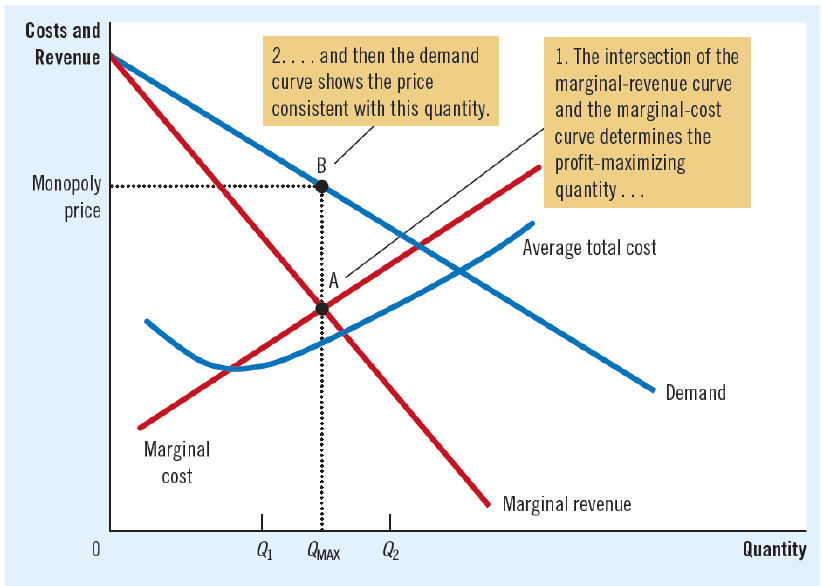
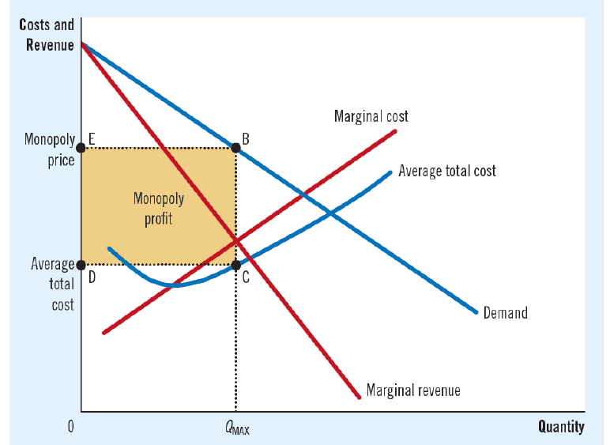
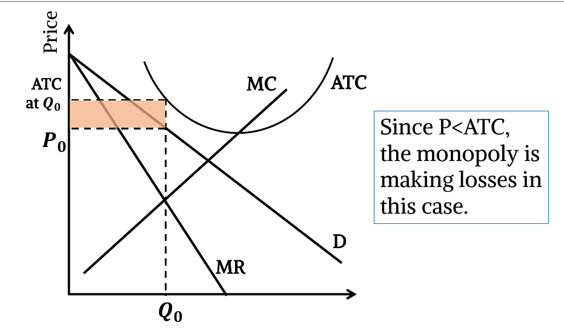
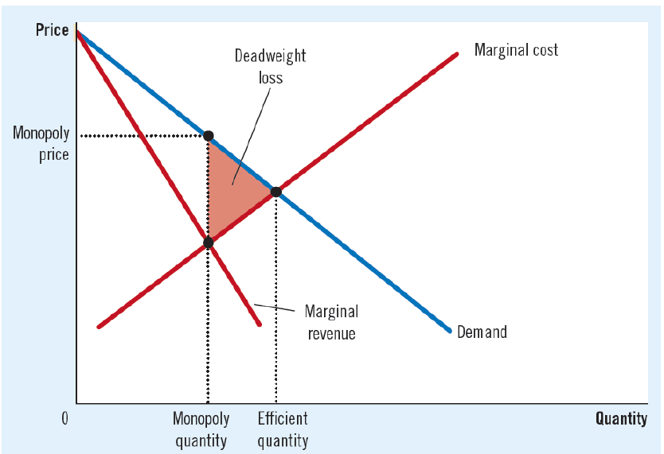

## Introduction

- **Features of a Monopoly Market:**
  - Many buyers and only one seller in the market.
  - Goods offered by the monopoly has no close substitutes.
  - Large barrier to enter or exit the market.
  - Monopolies are price makers.
- **Why Monopolies Arise?**
  - The fundamental cause of monopoly is **barriers to entry.** A monopoly remains the only seller in its market because other firms cannot enter the market and compete with it.
  - **Monopoly resources:** A key resource required for production is owned by a single firm.
  - **Government regulation:** The government gives a single firm the exclusive right to produce some good or service.
  - **The production process:** A single firm can produce output at a lower cost than can a larger number of firms (Natural Monopoly) (Economies of Scale).

## Monopoly Demand Curve

- Key difference between a competitive firm & a Monopoly is the
  ability to influence market price. It comes from the difference of the demand curve they face.
- Because a competitive firm can sell as much or as little as it wants at the market price, the competitive firm faces a horizontal demand curve at that price.
- Because a monopoly is the sole producer in its market, its demand curve is simply the market demand curve. Thus, the monopolist faces a downward sloping demand curve.

## Monopoly Marginal Revenue

- A monopolist’s marginal revenue is less than the price of its good, P > MR.
- Marginal revenue on all units after the first is less than the price.
- Thus, a monopoly’s marginal - revenue curve lies below its demand curve.
- **Demand & MR of monopoly:**
  
- **Price & Production:**
  
  - Profit Maximizing quantity of output is found where MR=MC.
  - Price is found from the demand curve at that quantity.
  - Here, P>MR & MR=MC.
- **Monopoly Profit:**
  
  - Profit = (P-ATC)Q.
  - Monopoly has the ability of earning positive economic profit in short run & in long run.
- **Loss Making Monopoly:**
  
- **Welfare Cost & Inefficiency of Monopoly:**
  
  - A competitive market produces efficient quantity where demand & supply (MC) curve intersects & P=MC.
  - But monopoly produces lower quantity where MR=MC but P>MC.
  - Therefore, monopoly quantity is inefficient & monopoly generates a deadweight loss.
