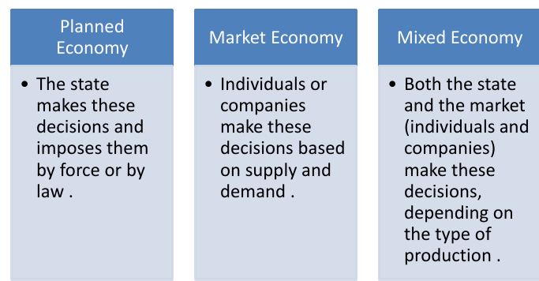
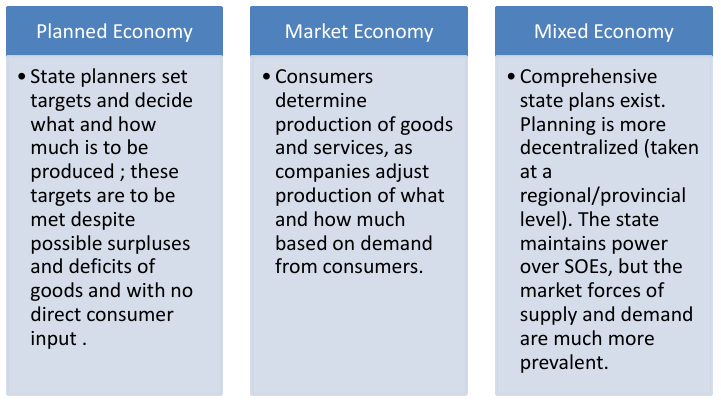
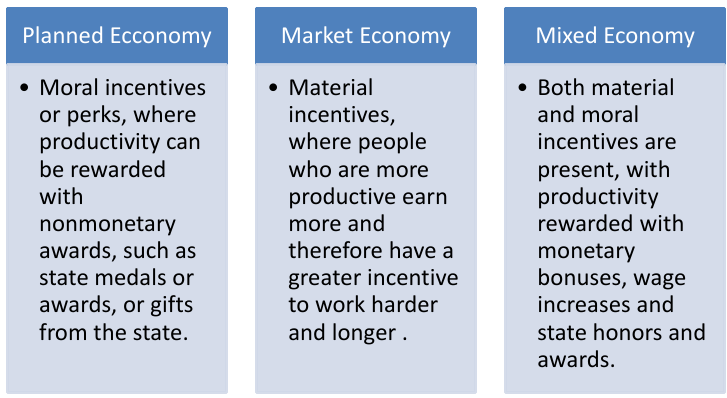
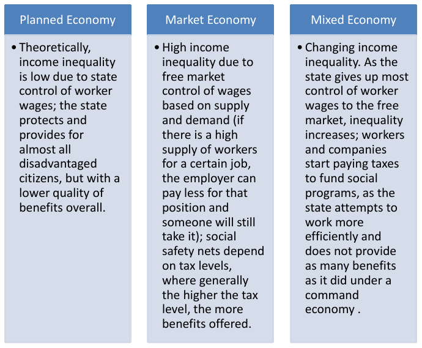
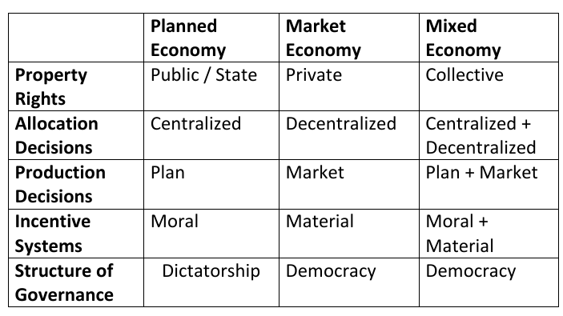

Economic system is the method or system of production, resource allocation & distribution of goods & services within a society or country of geographic region. These systems are used to control the factors of production.

## Major Types of Economic Systems

### #01 Market Economy

It is an economy system where the production of goods and services are decided by the laws of supply and demand. The prices of goods and services are determined in a free price system.

No central authority or government has control over market activity. Instead, it is controlled by the invisible hands of supply and demand.

It is a decentralized system.

_Other names: Capitalism, liberal democracy._

_Example: USA, UK, Japan, Canada etc._

**Capitalism:**

Market economy is originated from the concept of capitalism.

Capitalism is an economic system in which the means of production are privately owned and operated for profit. There are no limitations of property ownership.

Here capitalists invests in business which generates wealth which in is again invested in business.

**How market economy works?**

Market economy depends on the intention of buyer and seller. Here, buyer wants to buy goods and services at the lowest price and seller wants to sell goods and services at the highest price. Thus, they both pushes the economy to an equilibrium where buyer and seller both gets profited.

If any factor changes, say a scarcity of a product is created, the demand of the product will increase thus price of that product will increase. Which disturbs the equilibrium. But soon the competitive seller will introduce a new product and buyers will shift to the new alternative. The demand of the product will decrease and so will the price. Thus, equilibrium is restored.

Even though buyer and seller has opposite intention, they both contribute to run the market without any central authority forming a stable market.

**Origin of free market economy**

- The ideology of classical capitalism was expressed by Adam Smith in the late 18th century. He recommended leaving economic decisions to free play of self-regulating market forces.

- The French Revolution changed the philosophy of human lifestyle. Before the revolution, human believed in collective system and most of the time they were controlled by regions.

- But after the revolution, people started to believe in individualism. They started to believe that they can control their own life. Simply put, _You are more important than the system._ This is the time when capitalism started to rise.

- Change of art style reflects the life view of human before and after the French Revolution. Before the revolution, arts were abstract but after the revolution, art was more focused on human centric.

- After the French Revolution & during the industrial revolution, Smith’s policies were increasingly put into practice.

**Importance of free market economy**

Free market lets the market be self-regulated. It is a decentralized system. It allows growth of independent industries. Those industries help grow the economy of a country.

**Negative effects of free market economy**

Free market economy is inherently unequal. It creates two classes in society: industrialist and industrial worker.

The industrialist enjoy the profit of the business, while the industrial worker works for the industrialist. The industrial worker is paid less than the profit the industrialist makes. This creates a gap between the two classes.

The supply of labor is higher in underdeveloped and developing countries. Thus, the industrialist can pay less to the industrial workers as they can easily be replaced. This is one of the major problems of Bangladesh's textile industry.

More the growth of free market economy, more the gap between the two classes.

After the Great Depression of World War 2, thus the world starts to move from free market economy.

### #02 Planned Economy

_Other names: Command economy, communism, socialism._

_Example: Soviet Union, China (1949-1978), Cuba, North Korea etc._

It is an economy system where the production of goods and services are decided by the government. The government decides the price of goods and services.

It is a centralized system. Here, everyone receives what state allocates.

**Origin of planned economy**

- The growth of industrial capitalism and the development of the factory system in the 19th century also created a vast new class of industrial workers.
- In general, they faced miserable working and living conditions. Labor exploitation by the capital owners was an inherent systematic outcome.
- It inspired the revolutionary philosophy of Karl Marx.
- Socialism emerged as a response to the expanding capitalist system.

**Ideology of Communism**

The basic idea was to prevent worker exploitation from the ones who owned means of production since it creates an inherent inequality

Marx called the owners: Bourgeoisie & the workers: Proletariat

His Vision entailed:

- Abolition of Private property
- Equal Distribution of Output
- Creating a Classless Society

**Why Socialism Doesn’t Work?**

Socialism does not work because it is not consistent
with fundamental principles of human behavior.

Equal share of output doesn’t ensure Fairness. People who work more will receive the same reward as people who work less. This creates a lack of incentive to work more. In other words, it creates a lack of motivation.

It's an unfair system against human nature. Thus, a panned economy will ultimately collapse.

### #03 Mixed Economy

_Other names: Market socialist economy, Chinese Socialism._

_Example: Sweden, Norway, Iceland, Brazil, China (since 1979), Vietnam (since 1986), Bangladesh etc._

**Pivoting toward mixed economy of the USA (Not for final)**

Before the war world 2 USA was a free market economy heavily depends on luxurious products like automobile, TV etc. But after the war started, consumption of luxurious products are decreased.

As major industries were producing luxurious products, this decreasing rate caused industrialist to lose profit. As USA economy heavily depends on private sector, the economy of the USA was in a bad shape.

Another factor that contributed to economic disaster was the bloom of stock market. People were rushing to buy stocks as it's an easy way to make money even when sleeping. People were taking loans from banks to buy stocks. This created a bubble in the stock market.

But the bubble started to crash when major investors were selling their stocks when the war started. This created a panic in the stock market. People started to sell their stocks to save their money. This created a chain reaction and the stock market crashed.

As most of the money was loaned from banks, this market crash caused banks to go bankrupt.

The gradual fall of the economy created the great depression.

Now, the government was looking for a solution to save the economy. They found the solution in the equilibrium theory. The equilibrium theory was expected to normalize the situation.

The then president of the USA made a conference introducing some policies. Those policies included some large government projects. Those projects were expected to create jobs and, thus, pushes the wheel of the economy.

The president also decided to join the war, even though it was very late. This created new employment opportunities for people by joining the army. Which also contributed to the economy.

Thus, the negative fall of the economy was prevented.

**Origin of Mixed Economy**

- Beginning in the 1930s, Marx’s apocalyptic expectations were largely replaced by the less violent but equally disquieting views of the English economist John Maynard Keynes.
- Keynes argued that inadequate overall demand could lead to prolonged periods of high unemployment.
- He argued that uncertainty caused individuals and businesses to stop spending and investing, and government must step in and spend money to get the economy back on track.
- When the demand is inadequate, it creates high amount of unemployment. In this situation, economy falls. In moments like this, regulations from authorities and government is required to get the economy back on track.

**Introduction to Mixed Economy**

- Mixed economy is a combination of free market economy and planned economy.
- Government tries to regulate the market to make fair competitiveness for fair price.
- Authorities also take care of basic needs like education, health care etc.

## Difference between Market Economy & Planned Economy

### Ownership

- Means of Production: land and capital, such as factories and farms, and the equipment used to create goods.

### Allocation Decisions

How the decision of resource & factor distribution is made.

### Production Decisions

Who or what determines the type and quantity of goods and services produced in an economy.

- Surplus: An amount of something left over when requirements have been met; an excess of production or supply.

### Incentive Mechanism

How are people motivated to work and produce goods and services.

### Structure of Governance

How political decisions on economic issues are made and what is the structure of government.

### Income Equality and Social Safety Nets

- How large is the income gap between the poor, middle class, and the rich?
- What policies are in place to protect the unemployed, the sick, and the elderly?

- **Progressive taxation:** In a mixed economy, the government often implements progressive taxation, where higher-income individuals are taxed at higher rates. The revenue generated from these taxes can be used to fund social programs aimed at reducing income inequality, such as welfare, healthcare, and education.
- **Social safety nets:** Mixed economies tend to have more extensive social safety nets to support those with lower incomes. These safety net programs can include unemployment benefits, food assistance, and housing support, which can help mitigate the effects of income inequality.

### Gist

## References

- Class Lecture

## Contributors

- Shakib Hasan Shuvo (ID: 2020-1-2-030)
