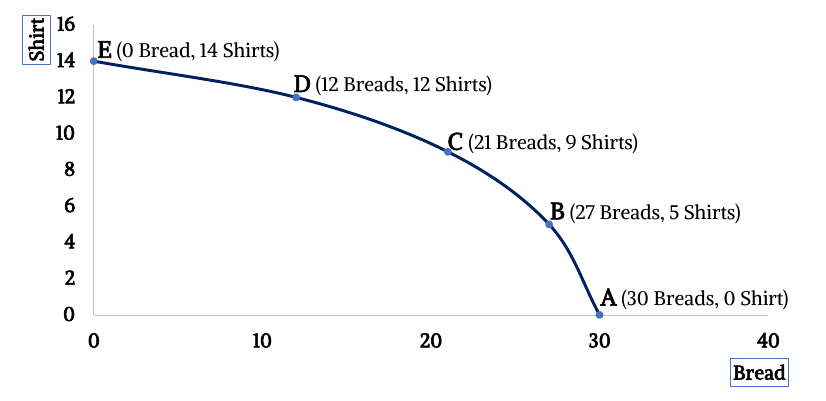
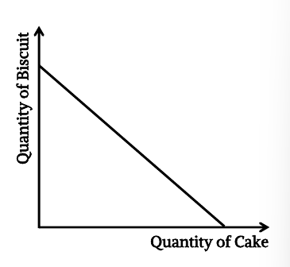
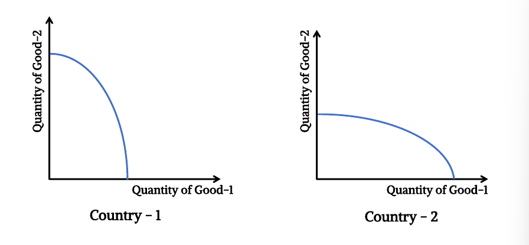
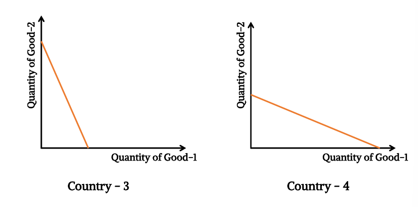
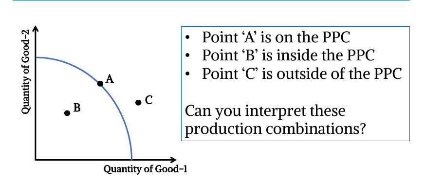
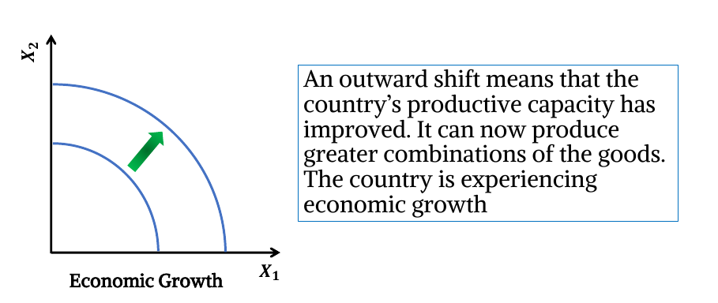
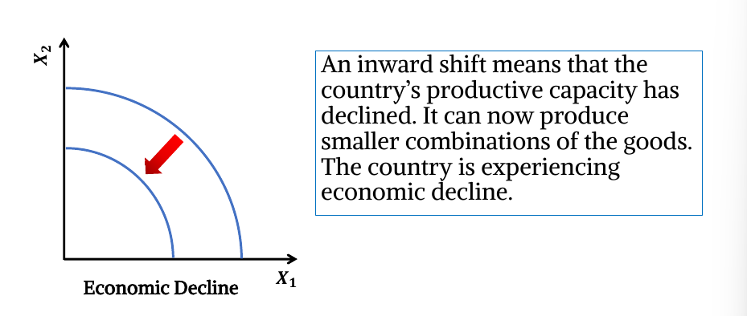

## Production Possibilities Frontier (PPF)

**_aka Production Possibilities Curve (PPC)_**

A graph that shows the combinations of output that the
economy can possibly produce given the available factors
of production and the available production technology is called PPF or PPC.

We can understand the productive capacity of a country
from its PFF. It shows scarcity, trade-offs, opportunity costs & efficiency.

## Understanding PPF/PPC

Consider a simple economy producing only 2 goods

- Good 1: Shirt
- Good 2: Bread

Note that a country has limited resources.

If the country employs all of its resources in the production of Breads, they can produce 30 Breads & no Shirt. If they wish to increase the production of Shirt, they need to transfer resources from Bread production to Shirt production, thereby lowering the number of Breads produced (& vice versa).

| Bread | Shirt |
| ----- | ----- |
| 30    | 0     |
| 27    | 5     |
| 21    | 9     |
| 12    | 12    |
| 0     | 14    |

Consider the rise of point A to B.

For producing 5 shirts costs 3 breads.
So, for producing 1 shirt costs 3/5 breads or 0.6 breads.

Here, the amount 0.6 breads is **opportunity cost**.

The process of producing 5 shirts which costs 3 breads is **trade off**.

So we can say the amount of give up cost is opportunity cost.

Again,

Point B to C:

Producing 4 more shirts requires giving up 6 breads

So, producing 1 more shirt requires giving up 1.5 breads

Opportunity cost is increasing from point A to B to C to D and so on.

Similarly, from point E to D, D to C, C to B & B to A will show that opportunity cost of producing bread increases as the number of bread produced increases.

## Law of Increasing Opportunity Cost

Increasing production of one good requires giving up more & more of the other good.

As you increase the production of one good, the opportunity
cost of producing the additional unit of that good will increase.

## Reason Behind Increasing Opportunity cost & Concave Shape of PPF

Resources are not perfectly adaptable to the production of each good.

If you want to increase output of one good, you need to withdraw resources increasingly from the production of the other good.

For example, the labor employed in bread production will not be equally effective in producing a shirt. (vice versa). Also, the same tools/equipment will not be equally productive for both goods. Thus, you need to withdraw more & more resources from one good to produce an additional unit of the other good.

## When the production is subject to constant opportunity cost

When increasing production of one good requires giving up equal quantity of the other good each time, then the production process is subject to a constant opportunity cost.

It can happen if resources are perfectly adaptable to the production of all goods.

Thus, the PPC will become linear.

## Variations of PPF

### Graph 1

- Country 1 has more resource adaptability. Country 1 is more efficient in producing good 2.
- Country 2 is less efficient is producing good 2 but more efficient in producing good 1.
- Country 1 & country 2 both are facing increasing opportunity cost in production

### Graph 2

- Country 3 & country 4 are facing constant opportunity cost in production.

### The Differences

- Country-1 & country-3 are more efficient in producing good-2 than producing good- 1.
  - Small reduction of Good-1 production leads to large increase in Good-2 production. Resources withdrawn from good-1 production can generate larger quantity of good-2. Resources are more suited for producing Good-2 in these countries. The country could also have technological advantage in the production of good-2.
- Country-2 & country-4 are more efficient (or have
  technological advantage) in producing good-1 than good-2

## Production Scenarios from the PPF

**Points on the PPC (such as ‘A’) are efficient production points.**

Since PPF shows the maximum possible production combinations with limited resources, points on the PPF mean that the country is fully utilizing its resources to produce any of those combinations.

**Points inside the PPC (such as ‘B’) are inefficient production points**

The country is not fully utilizing its resources. Thus, production is less than its maximum potential.

**Points outside the PPC (such as ‘c’) are impossible to attain.**

The country doesn’t have enough resource to achieve that production combination.

## Shifts in PPF

### Outward Shift of PPF

**Reasons for outward shift of PPF**

- Increase in the quantity or quality of the labor force.
- Increase in the quantity or quality of capital.
- Technological advancement/Better technical knowledge.
- Improvement in the stock or the quality of a nation's natural resources.

### Inward Shift of PPF

**Reasons for inward shift of PPF**

- Decrease in the quantity or quality of the labor force.
- Decrease in the quantity or quality of capital.
- Technological hazard.
- Decline in the stock or the quality of a nation's natural resources.

These situations can be caused by natural disaster or war.

## Acknowledgement

- **Reference:** Class Lecture
