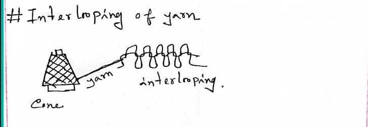
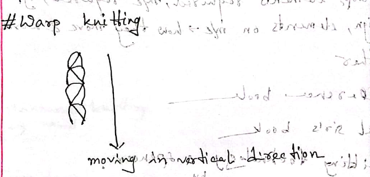
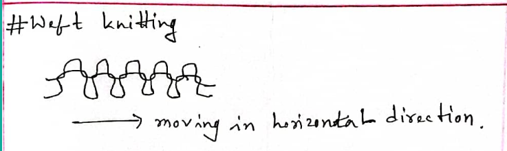

Knitting is the process of making a fabric by interlooping of yarns. The loops are made by a set of needles.

Knitting doesn't require preparatory process (like sizing).

_Figure: Interlooping of yarn_

Machine knitting is more efficient than manual hand-knitting, machine knitting has several times higher production rate than hand-knitting.

## Classification

Two types:

### Warp Knitting

_Figure: Warp knitting_

Used for making lace, braid, net, etc. Historically, comes after weft knitting. Has slightly open structure.

### Weft knitting

_Figure: Weft knitting_

Used for making sweater, socks, etc.
