## Introduction

The softeners are surface-active agents; that is, their molecules contain both hydrophilic and hydrophobic
components.

### Why are softeners used for textile processing?

1. To provide desired softness often described as smooth, supple, super soft, elastic, dry or slashy.

2. To influence or to improve technical properties, namely, antistatic, hydrophilicity, elasticity, sewability and rubbing fastness.

3. To confer natural touch on synthetic fibres and to improve their wearing comfort by the regulation of moisture content or smoothness.

### How softener improves softness, sewability and tear strength of fabric

1. Softeners act as fiber lubricants and reduce the coefficient of friction between fibers, yarns, and between a fabric and an object (an abrasive object or a person’s hand). Whenever yarns slide past each other more easily, the fabric will be more pliable and have better drape. If some of the lubricant transfers to the skin
   and the fabric is more pliable, the fabric will feel soft and silky.

2. The softening effect is mostly effective on the textile surface. In addition, small softener molecules may penetrate into the fibres and provide an internal plasticization of the polymers by reducing the glass transition temperature.

3. Sewing problems are caused by the friction of a needle rapidly moving through the fabric. Friction will cause the needle to become hot and soften thermoplastic finishes on the fibers. A softener will reduce needle heat buildup, provide a steady source of needle lubricant and thus reduce thread breakage.

4. Fabric tearing is a function of breaking yarns, one at a time, when tearing forces are applied to the fabric. Softeners allow yarns to slide past each other more easily therefore several yarns can bunch up at the point of tear. More fiber mass is brought to bear and the force required to break the bunch is greater than the force required to break a single yarn.

## Essential Properties of Softeners

1. Available in forms convenient to handle: stable liquid, predilutable and dosable.
2. Compatible with common textile auxiliaries.
3. Nonvolatile and stable in high temperature.
4. Nonyellowing.
5. Should not affect color fastness of dyed materials.
6. Low foaming and shear stable; does not deposit on rollers.
7. Preferably applicable by exhaust processes with good properties.
8. Ecofriendly, nontoxic and dermatologically safe.
9. Biodegradable and good price performance.

## Classification of Softeners

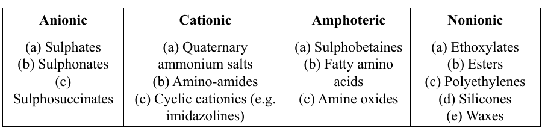

## Mechanism of Softening Effect

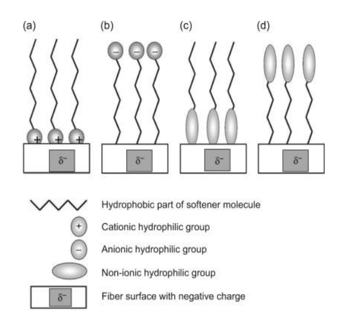

The physical arrangement of the usual softener molecules on the fiber surface is shown in the figure. It depends on the ionic nature of the softener molecule and the relative hydrophobicity of the fiber surface.

- **Figure (a):** Cationic softeners orient themselves with their positively charged ends toward the partially negatively charged fiber (zeta potential), creating a new surface of hydrophobic carbon chains that provide the characteristic excellent softening and lubricity seen with cationic softeners.

- **Figure (b):** Anionic softeners, on the other hand, orient themselves with their negatively charged ends repelled away from the negatively charged fiber
  surface. This leads to higher hydrophilicity, but less softening than with cationic softeners

- **Figure (c) & (d):** The orientation of non-ionic softeners depends on the nature of the fiber surface, with the hydrophilic
  portion of the softener being attracted to hydrophilic surfaces and the hydrophobic portion being attracted to hydrophobic surfaces.

## Cationic Softener

Cationic softeners are ionic molecules that have a positive charge on the large part of the molecule. The important ones are based on nitrogen.

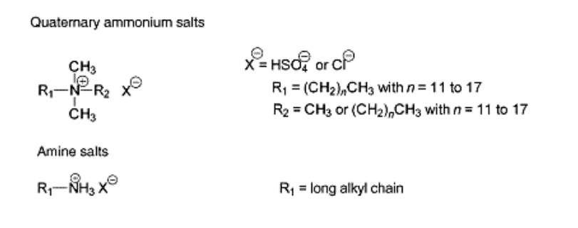

### Advantages

1. Cationic softeners have the best softness and imparts fluffy, silky hand to most all fabrics at very low levels of
   add-on.
2. Cationic softeners are reasonably durable to laundering.
3. They have affinity to almost all fibres and are usually applied by the exhaust method in acid environment (pH 4-5).
4. Cationic improves tear resistance, abrasion resistance and fabric sewability.
5. Cationics also improve antistatic properties of synthetic fibers.
6. They are compatible with most resin finishes.

### Disadvantages

1. They are usually not compatible with anionic products (precipitation of insoluble adducts).
2. They provide a hydrophobic surface and poor re-wetting properties, because their hydrophobic groups are oriented away from the fiber surface.
3. They have poor resistance to yellowing for which Cationic softeners are mainly used for colored textile substrates.
4. They may change dye shade or affect light fastness of direct and reactive dyes.
5. They retain chlorine from bleach bath.

### Yellowing of Fabric due to Cationic Softener

- Due to the chemical nature of most softeners they trend to turn yellow and change color with factors such as high temperature, prolonged storage and their formulation.
- The high free amine value (not protonated) of the cationic softener causes color change due to air oxidation during drying phase.
- They also retain chlorine from bleach bath which form chloramine and also causes yellowing of fabric.
- Today, cationic softeners with ester quate structure that don't contain free amines can be preferred in colors not to cause yellowing.

## Anionic Softener

Anionic softeners are composed of a high molecular weight fatty chain with their notable solubility conferred by $–COONa$, $-OSO_3Na$ and $–SO_3Na$ groups. Anionic softeners have limited use in textile processing at present.

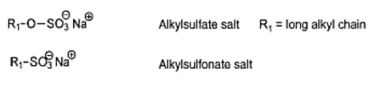

### Advantages

1. Anionic softeners are heat stable at normal textile processing temperatures and some resistant to yellowing.
2. Works as crease-preventing agents in dyeing processes.
3. They are compatible with other components of dye and bleach baths.
4. They can provide strong antistatic effects and good rewetting properties because their anionic groups are oriented outward and are surrounded by a thick hydration layer.
5. Sulfonates are, in contrast to sulfates, resistant to hydrolysis.
6. They are often used for special applications, such as medical textiles, or in combination with anionic fluorescent brightening agents.

### Disadvantages

1. Limited durability to laundering and dry cleaning.
2. Anionics will not exhaust from a bath, they must be physically deposited on the fabric.
3. Anionics tend to be sensitive to water hardness and to electrolytes in finish baths.
4. Anionics are incompatible in some finish baths containing cationically stabilized emulsions.

## Nonionic Softener

Nonionic softeners do not carry any electrical charge and therefore do not possess any distinctive substantivity. Such
products are applied by means of forced application (i.e. usually in padding mangle procedures).

Nonionic softeners can be
combined universally, are stable to temperature and do not show yellowing. This is the reason that this product class is
perfect for finishing optically brightened, highly white articles.

They have a general formula, $R(OC_2H_4)_nOH$ or $R(C_2H_4)_nOOH$ (where
R=alkyl), and contain different nonionic components such as fatty alcohols, ethoxylated fatty alcohols and fatty amines,
paraffins and oxidized polyethylene waxes as active ingredients.

It should be noted that In case of nonionic softener each softener has different function.

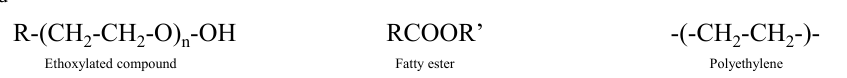

## Amphoteric Softeners

Amphoteric products give an average handle, are normally compatible with white and give the fabric a good hydrophilicity, as well as excellent antistatic properties. They have poor durability in washing.

Amphoteric softeners compounds are compatible with human skin and are often used for hygiene articles. They are widely used for finishing of terrycloth towels.

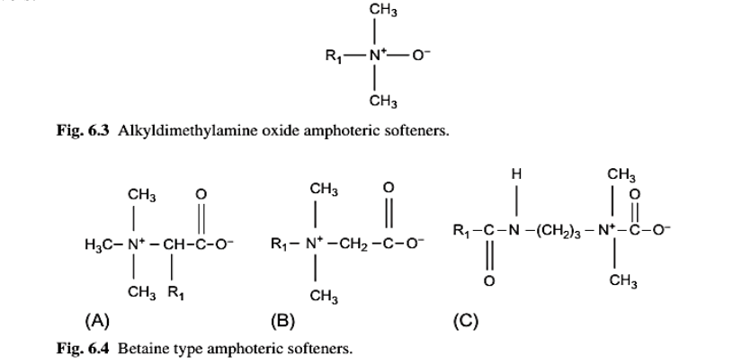

## Reactive Softeners

The softeners described above are merely deposited on the materials (i.e. they are washed fast). Reactive softening agents can partially react with cellulose on account of their chemical structure and thus give permanent effects.

### N-methylol Reactive Group

N-methylol reactive group can react with cellulose fiber in the presence of acidic catalyst like magnesium chloride, ammonium dihydrogen phosphate etc. at elevated temperature (140-150 °C).

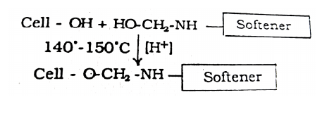

### Octadecyl Ethylene Urea

Octadecyl ethylene urea reacts with the cellulosic hydroxyl forming a stable bond, durable to laundering.

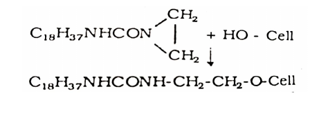

In addition, some polymerization of octadecyl ethylene urea takes place and this polymer gets hydrogen bonded
to cellulose.

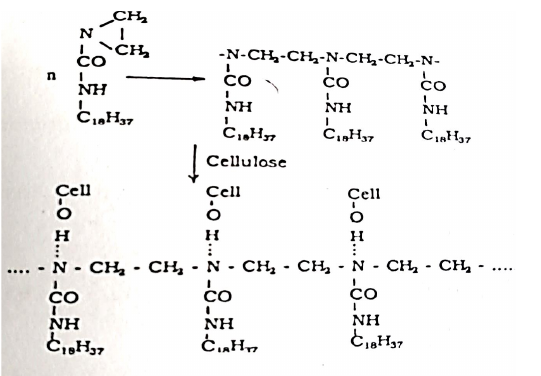

The reactive softener may be applied as a nonionic softener without curing, when only a temporary softening effect is produced which is not fast to washing. This may be applied by pad dry technique.

## Silicone Softener

Silicone softener is one kind of non-ionic softener. They are insoluble in water, and therefore must be applied on fabrics after emulsification or dissolution in organic solvents.

### Unique Properties of Silicone

Due to thier inorganic–organic structure and the flexibility of the silicone bonds, silicones have unique properties:

- Thermal oxidative stability
- Low temperature flowability
- Low viscosity change against temperature
- High compressibility
- Low surface tension
- Hydrophobicity
- Good electric properties
- Low fire hazard

### Advantages

- One of the key features of silicone materials is their effectiveness at very low concentrations. Very small amounts of silicones are required to achieve the desired properties, which can improve the cost of textile operations and ensure a minimum environmental impact.
- Normally, due to their difficult emulsion, they were supplied as macroemulsions (emulsion drop diameter: 1–200 μm) and impart a smooth feel. The silicone drops
  do not penetrate textile materials and remain mostly on the surface to impart water repellency.
- The mechanism of softening by silicone treatment is due to a flexible film formation. The deposition of flexible film reduces interfibre and interyarn friction. Thus the silicone finishing of textile produces an exceptional soft handle.

### Conversion of chlorosilane to silanol and polysiloxane

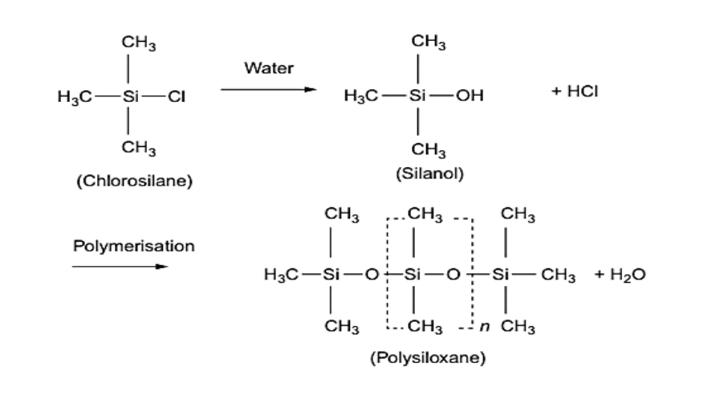

### Orientation of silicone softener on fiber surface

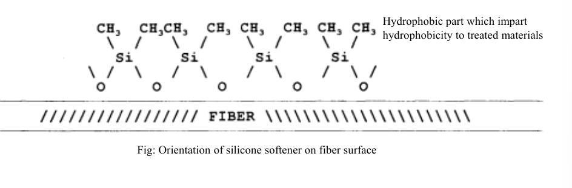

### Examples of Silicone Softeners

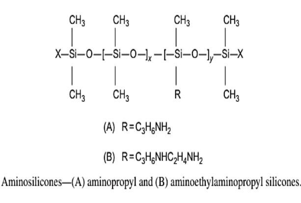

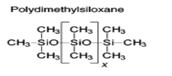

### Hydrophilic Silicones

Poor wettability is highly undesirable for various textile materials like towels, underwear, sportswear, etc. Most of the highly effective softeners, including silicones, impart a considerable hydrophobicity to textiles.

The wettability of silicone-treated goods can be improved in a number of ways. The first generation of hydrophilic silicones, available commercially for decades, contains
polyether, namely, polyethyleneoxide (PEO) and/or polypropyleneoxide segments as a side chain or as part of the main polymer backbone, aminopolyether siloxane and polyether siloxane. These silicones with polyglycol groups show excellent hydrophilicity and act almost as wetting agents.

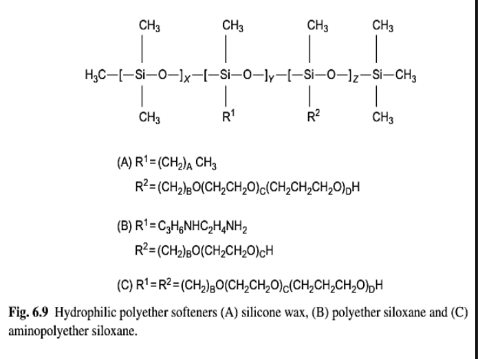

## Important Softener Characteristics by Class

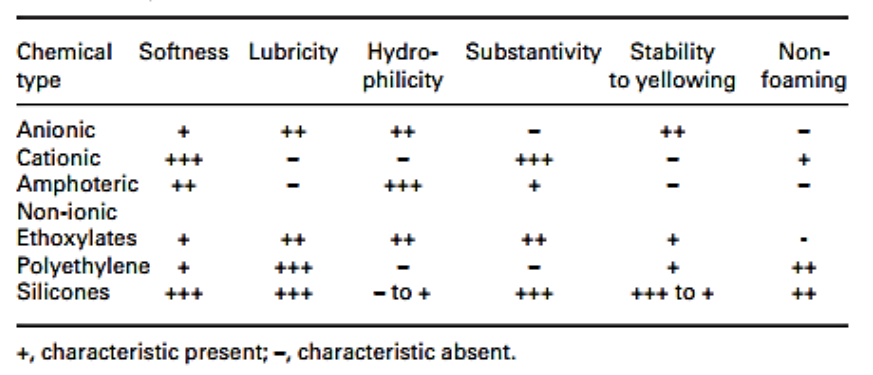

## Softener Application Recipe

- Softener = 20-25 g/L
- PH = 4-5
- Drying: $120-140\degree C$ for 2-3 minutes
- Application process: Padding
