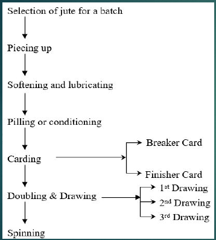
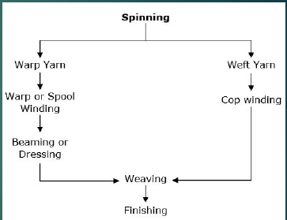

Jute is a natural cellulosic bast fiber. It's a long staple fiber.

Jute consists of bast overlapped in such a way that they produce continuous filaments. They provide strength as well as flexibility to the stem of the plant. So they are called bast fibers.

Jute is consists of 65.2% cellulose.

**Why jute is not wearable?**

Jute has the same amount of cellulose as cotton. But jute is not wearable because of the presence of lignin. Lignin is a non-cellulosic substance. It is a hard substance. It is present in the cell wall of jute. Lignin makes jute harsh, hard and brittle. So, jute is not wearable.

**Why jute is called golden fiber?**

Jute is called golden fiber due to,

1. It's golden color.
2. Brings foreign currency.

## Use of jute

### Diversified use of jute

1. Automobile industry
2. Aircraft industry
3. Geo-textile
4. Building construction

### Name of everyday jute products

1. **Bags:** ladies, lunch, shopping, school, etc. bags.
2. **Home:** home decor, rope, rugs.
3. **Garments:** Women's sharee, slwar kameez. Man's panjabi, fatua.

_Jutton is the blend of jute and cotton._

## Types of jute yarn

1. Hessian warp yarn.
2. Hessian weft yarn.
3. Sacking warp yarn.
4. Sacking weft yarn.
5. CBC yarn of 224-294 tex used as carpet backing.
6. Twine of different counts.

## Jute yarn count

**Pounds/spyndle:** weight in pounds per 1440 yds of jute yarn is called pounds/spyndle. Here 1 spyndle= 14400 yards.

For example, if 1440 length of yarn weights 8 pound, then the count is 8 lbs/spyndle.

## Classification of jute

### Botanical classification

Two types of jute are mainly used,

1. _Chorchorus Capsularis_
2. _Chorchorus Olitorius_

### Classification according to quality

**According to geographical distribution**

1. **JAT:** Best quality, good color, luster, finest, higher length. Grows in Mymensingh, Dhaka and Comilla
2. **District:** Moderate quality, Close to jat in quality. This jute fiber is not uniform in textures and strands. Its color varies from light cream to dull gray. Its length is shorter. Two types,
   1. **Hard:** Higher quality.
   2. **Soft:** Lower quality.
3. **Northern:** Somewhat inferior quality. This jute fiber is dull colored fluffy hair and barky. Generally medium length and weak.

## Properties of Jute

1. **Fiber surface and appearance** is yellow to brown to dirty color. Lusty appearance.
2. **Tensile strength:** Not stronger than flax because of the
   irregularities in the thickness of cell wall.
3. **Elongation:** Breaks at 1.7%.
4. **Elastic Properties:** Stiff fiber. Do not return to its original length after completely relaxed.
5. **Specific gravity:** 1.5.
6. **Length:** 1-4 meter.

## Flow Chart of Jute Manufacturing

