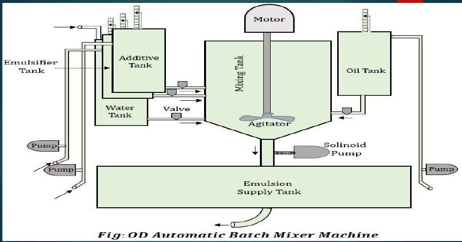
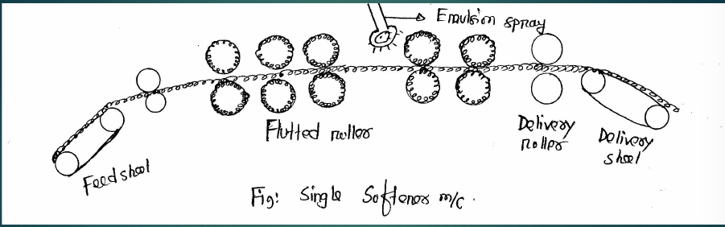
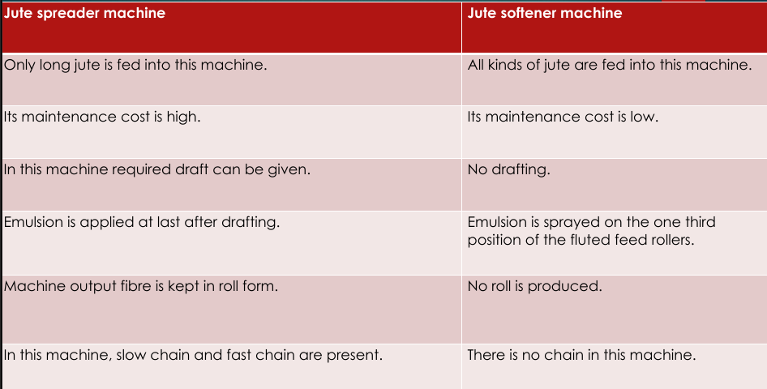

## ‘OD’ automatic batch mixer

The ‘OD’ batch mixer is a simple automatic machine for producing stable batching emulsion for jute. This volumatric batch mixing machine produces perfectly blended and stable emulsion.

- **Procedure:**
  - The percentage of emulsifier, oil and water accurately and automatically measured by volume.
  - The percentage of oil and emulsifier can be adjusted easily by setting the pointers on the oil and emulsifier scale. When adjusted, the machine automatically adds the required percentage of water to complete 1000 L.
  - Once the required percentages are set, the machine will automatically continue to measure and mix these percentages each time.
  - After all the ingredients are added, the agitator or paddle starts to rotate at a high RPM. Then emulsion is formed which is then stored to the storage tank under the mixing tank.
- **Procedure of emulsion preparation (hot):**
  - Emulsifiers and equal quantity of mineral oil are placed in the mixing tank and mixed them into a jelly like substance.
  - Then remaining oil is added slowly with heat applied and agitator running (approx 35 min).
  - Required amount of water is slowly added with agitator, mixing them to the required form (approximately 20 min).
  - When emulsification is completed then the mixture is pumped to the gravity supply tank from where the emulsion is passed to the softener or spreader machine through suitable pipelines. Hot emulsion is effective well and penetrates well into the jute fiber and gives always-good results.

## Jute softener machine-single softener machine

- **Construction:**
  
  - These machines consist of 24-64 pairs of rollers.
  - Rollers are spirally fluted and jute goes through them.
  - A feed sheet and a delivery sheet is placed before
    feed rollers and after delivery rollers respectively.
- **Working Procedure:**
  - In this machine, material is fed manually on feed sheet (6ft long).
  - Then through feed roller the material goes through a series of spirally fluted rollers. Spirally fluted rollers have right hand and left hand spiral flutes alternative.
  - After passing 1/3 area between the feed rollers and delivery roller, emulsion is applied over material, which soften jute, and a tray below the machine collects excess emulsion.
  - Then through the delivery roller, the material is delivered from delivery sheet.

## Jute spreader machine

_To be added._

## Jute Spreader vs Softener Machine

## Acknowledgement

- **Reference:** Class Lecture
