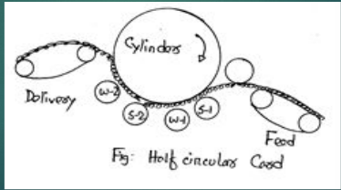
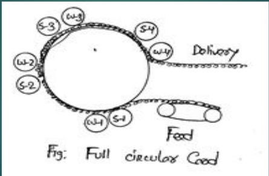
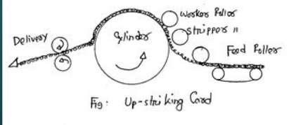
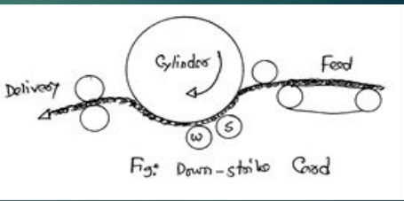

The process by which long reeds of jute while passing through high speed pinned rollers are broken down into an entangled mass and delivered into the form of ribbon of uniform weight per unit length is called carding.

## Objects of Carding

- To break down and split up the fiber.
- To make the sliver of uniform weight per unit length.
- To remove dirt and dust.
- To individualize and parallelize the fiber.
- To straighten the fiber drafting.
- To reduce wt per unit length.

## Classification of Carding Machine

### According to cylinder function

1. **Half Circular:** In half-Circular Cards jute travels the half-way round the main cylinder in its journey from the feed to the delivery. Thus the feed and delivery are approximately $180 \degree$ apart. Example: Breaker Card.

   

2. **Full Circular:** In this machine jute travels almost full way round the main cylinder in its journey from feed to delivery. Thus the feed and delivery are almost side by side. Example: Finisher Card.

   

### According to Striking

1. **Up Striking:** In this machine, the pins of the cylinder approach the feed from underneath and strike up the fiber. Up striking cards are used for low quality jute as the dirt and short fibers can not be collected below it can again mingled with the fibers. Here fiber loss is low.

   

2. **Down striking:** In this machine, the cylinder pins approach the feed from the top and strike down into the fiber. Down striking cards are used for high quality jute. The dirt and short fibers are collected below and they can not mingle with the fibers again. But here the rate of fiber loss is high. Pins of down striking cards are thick.

   

### According to processing

1. **Mono Carding machine:** When a single carding machine with one cylinder is used for carding, its is called Mono carding machine. It is used for cotton, not successful for jute.
2. **Dual carding machine:** When two individual carding machine i.e. breaker card and finisher card are used in carding, they are called dual carding machine. It is used for jute processing.
3. **Tandem carding machine:** When two carding machines are used at a combination then it is called Tandem Carding machine. The motion is transferred from 1st machine to the 2 nd machine. When one machine stops the other stops automatically. It is used in case of Roller spinning in Cotton. In tandem carding machine, two individual cards make up a unit. The doffer of the 1 st card feeds fiber material to the taker-in of the 2nd card. Double carding of the raw material has a positive effect on quality and on blending. However the advantage is obtained at high cost hardware and maintenance. Again additional space is required for tandem card. About 1% cotton is processed with tandem cards now. Modern cards are considered as a tandem of the latest generation.

### According to Roller and Flat

1. **Stationary flat card:** In which the flats on the cylinder are fixed and cylinder moves.
2. **Revolving flat card:** In which the flats on the cylinder are moving and cylinder moves.
3. **Roller card:** Breaker card, Finisher card, not flat card.
