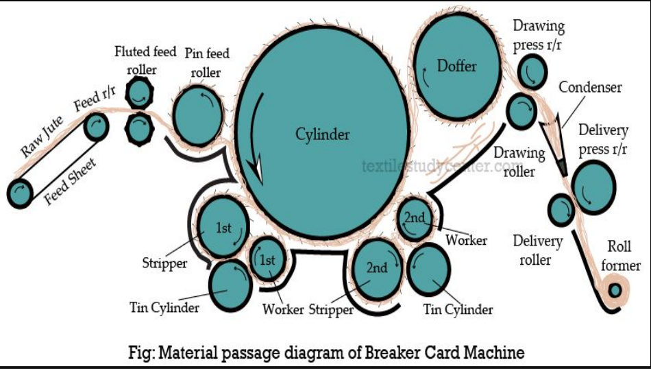
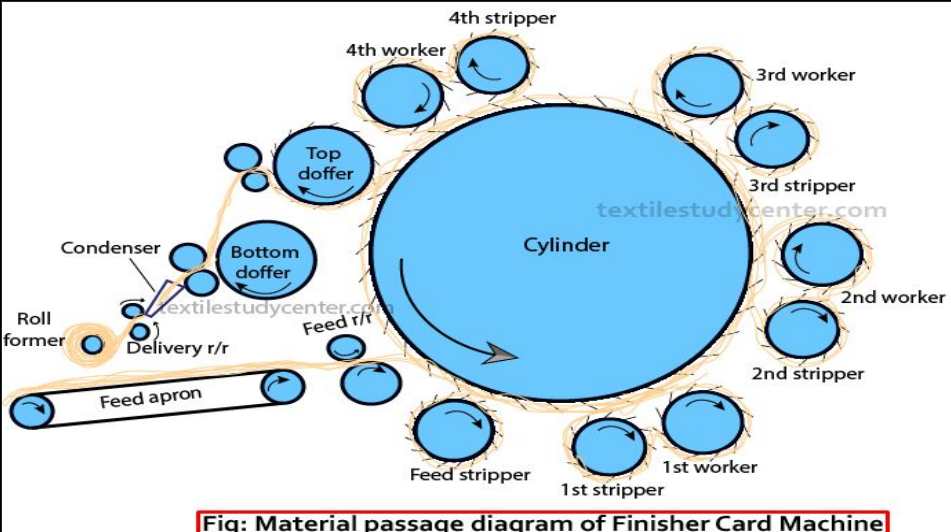
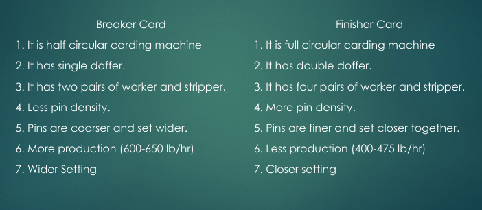
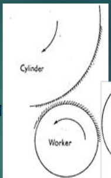
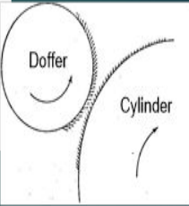

## Breaker Carding Machine

Breaker Cards are generally down striking and half-circular. In this machine the primary function of jute carding is done by the action of worker and cylinder and the cleaning actions is done between worker and stripper. It is called Breaker Card because it breaks up to the long reeds of jute.

### The main three functions of breaker Card

1.  Individualization of fiber.
2.  Drafting of fiber.
3.  Sliver formation.

### Main parts

- A main cylinder
- Shell
- Fluted feed Roller
- Pin feed Roller
- A pair of Stripper
- A pair of worker
- A pair of tin cylinder
- Doffer
- Drawing Roller
- Delivery Roller

### Working principle:

- The Roll of 6-8 slivers are fed on to the feed sheet from a creel at floor level towards the feed roller of the breaker card.
- The jute now enters the machine through shell feed. This consists of a pin feed Roller and a cast iron shell.
- The jute enters the space between the pin feed Roller and the shell and travels towards the swift moving pins of the main cylinder.
- When the feeding ends of the reeds meet these fast moving pins, they are split, opened out and converted into a fibrous beard.
- When jute fibers come in contact with the slow speed of the workers which gives carding action together with cylinder but not stripping.
- The back pointing pins of the worker opposes cylinder pins, point against point to catch up loose fibers and at the same time open out and card the fiber.
- The fibrous raw striped by the workers are carried round with them and ultimately stripped by pins of the faster running stripper roller.
- The wastage is then discharged through the tin cylinder.
- In this way, jute passes 1st and 2nd worker-stripper pairs.
- After leaving the 2nd worker-stripper pair fleece of fibers meet the doffer which stripes jute off the cylinder. Then the fibers pass through drawing Roller into V-shaped condenser.
- The fibers are delivered to delivery roller and delivery processing roller.
- Finally the sliver obtained in the roll form.

### Speed of Breaker Card & pin angel & setting:

- Cylinder – 2400 to 2700 ft/min
- Feed Roller – 9 to 14 ft/min
- Worker – 35 to 50 ft/min
- Stripper – 300 to 500 ft/min
- Doffer – 75 to 95 ft/min
- Drawing rollers – 150 to 200 ft/min

## Finisher Carding Machine

Finisher card is full circular and down sticking card. After jute is processed by breaker card, it is sent to finisher card. The rollers and cylinder are pinned in the same manner as in breaker card but pins are finer and set closer together in Finisher Card Machine.

### Main Parts

- Feed sheet
- Pin feed roller
- Feed stripper
- Top feed roller
- 4-worker rollers (1st, 2nd, 3rd, 4th)
- 4-stripper rollers (1st, 2nd, 3rd, 4th)
- 2-Doffers (top and bottom)
- A main cylinder
- 2-pairs of drawing roller (top and bottom)
- A pair of delivery rollers

### Working Principle

- 10-12 slivers obtained from breaker card are placed side by side at the fed end of finisher card.
- Two types of feed system such as shell feed system and double pinned fed system.
- Shell fed used for sacking weft cards and light carding loading is possible in double pinned feed.
- The fibers come in contact with top feed roller, pin feed roller and feed stripper. Pin feed Roller and feed stripper have pins pointed against the back, and only a small amount of carding action takes place here.
- Then the fiber transfer to the worker. Cylinder speed is quite higher than the worker. Here carding action takes place.
- When the fibers are combed between workers and stripper, the stripper takes the fiber forward to the cylinder surface, it to the coming second worker-stripper. Here the fibers are thinned down and individualized.
- The same action is repeated along the 2nd, 3rd and 4th pair of worker and stripper. While leaving the 4th pair of worker-stripper, the fibers come to the action of doffer where the fiber is received and combing action tables place since the pin direction of doffer and cylinder is opposite.
- Then the fiber are passed through drawing Rollers and are transferred to the 2nd doffer and drawing Roller and delivery Roller.
- Finally, the finisher sliver is condensed to delivery in roll form.

### Speed of Breaker Card & pin angel & setting:

- Cylinder - 2400-2800 ft/min
- feed Roller - 10-15 ft/min
- worker - 30-40 ft/min
- stripper - 300-500 ft/min
- Doffer - 75-100 ft/min
- Drawing Roller - 150-200 ft/min
- Delivery Roller - 150-200 ft/min.

## Difference between Breaker Card and Finisher Card

## Why two carding machines are used in jute processing?

- Breaker card only open out the fiber and remove dirt and dust.
- Breaker card sliver obtained from breaker card are not complete free from defaults and trash, dirt, dust, foreign matters are present in breaker card sliver. Another carding machine is required to remove faults i.e. dirt, dust, trash and parallelizing of the fiber. To perform this function, another carding machine which is used is finisher carding machine.
- Fibers obtained from breaker card does not have spinning property required. So finisher card is used for making the fibers spinnable.

## Factors which influence carding

_Or, Modern trends and developments of carding_

- **Pin density:** The more pin density of rollers the more carding action and less pin density will give less carding action.
- **Cylinder speed:** Greater cylinder speed will give more carding action.
- **Feed load:** The more feed load, carding will be bad, but if feed load become lighter, carding will be better. Because small amount of feed material will be treated by the rollers properly.
- **Speed of feed Roller:** Slower speed of feed Roller gives more carding due to feeding of less material into the machine per unit time. But faster speed will give reverse effect.
- **Worker speed:** If worker speed is high carding will be low and again higher pin density on worker will give more carding action.
- **Stripper speed:** Speed of stripper has no effect on carding action. But when stripper speed is high, good stripping will be.
- **Roller setting:** If the rollers are setting more closely then the carding action may be high.

## Functions of cylinder & worker

- **Cylinder:**
  - To take the jute fiber from feed roller, so machine do not jam due to excess jute.
  - To open out the fibers.
  - To take the fibers from stripper.
- **Worker:**
  - To take the fibers from cylinder
  - To open out and card the fiber.
  - To remove waste, trash, dirt and dust.

## Action of carding machine

- **Carding action:**

  

  - Between worker and cylinder.
  - Pin direction is opposite.
  - Direction of rotation opposite.
  - Speed of cylinder is higher than that of worker.

- **Doffing Action:**

  

  - Between cylinder and doffer.
  - Pin direction opposite.
  - Rotation direction opposite.
  - Speed of cylinder is higher than that of doffer.

- **Stripping Action:**
  - Between Worker and Stripper.
  - Pin direction same.
  - Rotation direction same.
  - Speed of stripper is higher than worker.

## Acknowledgement

- **Reference:** Class Lecture
